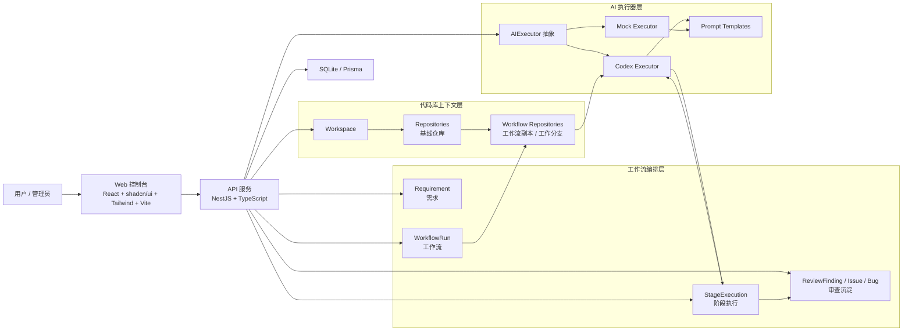

# AI R&D Orchestration MVP

This repository contains a staged, interruptible, human-confirmable AI研发调度系统 MVP.

## Architecture



### Flow at a glance

1. 在 `Workspace` 下登记代码库，系统拉取基线仓库并维护当前分支。
2. 创建 `Requirement` 后发起 `WorkflowRun`。
3. 工作流会为每个仓库准备独立的 workflow 副本和工作分支。
4. `Task Split -> Technical Plan -> Execution -> AI Review` 按阶段推进，关键节点必须人工确认。
5. 执行与审查结果结构化落库，并可沉淀为 `ReviewFinding / Issue / Bug`。

## Stack

- Backend: NestJS + TypeScript + Prisma + SQLite
- Frontend: React + shadcn/ui + Tailwind + Vite
- AI integration: provider abstraction with Codex / Mock executor

## Structure

- `docs/system-design.md`: MVP system design
- `docs/docker-deployment.md`: Docker 与 Nginx 部署指南
- `docs/deploy-integration-design.md`: 部署集成设计与扩展方案
- `apps/api`: backend service
- `apps/web`: basic management UI
- `prisma`: Prisma schema

## Quick start

1. Create `.env` in the repository root:

```env
DATABASE_URL="file:./dev.db"
PORT=3000
VITE_API_BASE_URL="http://localhost:3000"
DINGTALK_APP_ID=""
DINGTALK_APP_SECRET=""
DINGTALK_AGENT_ID=""
```

2. Install dependencies:

```bash
pnpm install
```

3. Generate Prisma client and sync schema:

```bash
pnpm prisma:generate
pnpm --filter flowx-api exec prisma db push --schema ../../prisma/schema.prisma
```

4. Start both apps:

```bash
pnpm dev
```

## Deploy integration

FlowX now includes an isolated deploy integration module for repository-level CI/CD adapters.

- Provider abstraction lives under [apps/api/src/deploy](/Users/chalkley/workspace/FlowX/apps/api/src/deploy)
- Design document: [docs/deploy-integration-design.md](/Users/chalkley/workspace/FlowX/docs/deploy-integration-design.md)
- Default provider is `noop`
- Real providers can be selected with `DEPLOY_PROVIDER`

Example API environment variables for Rokid OPS:

```env
DEPLOY_PROVIDER=rokid-ops
DEPLOY_ROKID_OPS_CREATE_JOB_URL=http://ops-manage.rokid-inc.com/api/cicd/app/createJob
DEPLOY_PROVIDER_TIMEOUT_MS=10000
```

## Docker deployment

完整部署说明见 [docs/docker-deployment.md](/Users/chalkley/workspace/FlowX/docs/docker-deployment.md)。

This repo includes a multi-stage `Dockerfile` that builds both the API and the web app.

Build the image:

```bash
docker build \
  --build-arg VITE_API_BASE_URL="/api" \
  -t flowx:latest .
```

Run the container:

```bash
docker run -d \
  --name flowx \
  -p 3000:3000 \
  -p 4173:4173 \
  -e PORT=3000 \
  -e WEB_PORT=4173 \
  -e DATABASE_URL="file:/data/dev.db" \
  -e AI_EXECUTOR_PROVIDER="mock" \
  -e OPENAI_API_KEY="your_openai_api_key" \
  -e CODEX_HOME="/data/.codex" \
  -e DINGTALK_APP_ID="your_app_id" \
  -e DINGTALK_APP_SECRET="your_app_secret" \
  -e GIT_AUTHOR_NAME="FlowX Bot" \
  -e GIT_AUTHOR_EMAIL="flowx@example.com" \
  -v flowx-data:/data \
  flowx:latest
```

Notes:

- API runs on `3000`
- Web runs on `4173`
- SQLite data is stored in `/data/dev.db`, so mounting `/data` is recommended
- The container startup script will run `prisma db push` automatically before starting services
- The runtime image now installs both Codex CLI and Cursor CLI
- Codex login state is stored under `/data/.codex` by default, so mounting `/data` will persist `codex login`
- `AI_EXECUTOR_DEFAULT_PROVIDER` can be set to `codex` or `cursor` as the default provider for new workflows
- If you want to use `AI_EXECUTOR_PROVIDER="codex"`, set `OPENAI_API_KEY` in the container
- If you want to use Cursor on the server, set `CURSOR_API_KEY` in the container and choose `Cursor CLI` when starting a workflow
- If you want workflow `提交并推送到远程` to work, the container must have:
  - reachable git remote credentials (SSH key or HTTPS token)
  - git identity configured, e.g. `GIT_AUTHOR_NAME` and `GIT_AUTHOR_EMAIL`
- `AI_EXECUTOR_PROVIDER="codex"` still requires valid Codex authentication in the container; in server environments the simplest way is `OPENAI_API_KEY`
- If Docker/host kernel blocks Codex `read-only` sandbox with `bwrap: No permissions to create a new namespace`, set `CODEX_READ_SANDBOX="danger-full-access"`

### Using manual `codex login` in Docker

If you are still in a personal-use stage and prefer logging into Codex manually instead of configuring `OPENAI_API_KEY`, you can:

1. Start the container with `AI_EXECUTOR_PROVIDER="codex"` and mount `/data`
2. Enter the container once and run `codex login`
3. Keep using the same `/data` volume so `/data/.codex` persists across restarts

Example:

```bash
docker run -d \
  --name flowx \
  -p 3000:3000 \
  -p 4173:4173 \
  -e PORT=3000 \
  -e WEB_PORT=4173 \
  -e DATABASE_URL="file:/data/dev.db" \
  -e AI_EXECUTOR_PROVIDER="codex" \
  -e CODEX_HOME="/data/.codex" \
  -v flowx-data:/data \
  flowx:latest

docker exec -it flowx sh
codex login
```

After login succeeds once, the Codex auth state will stay in the mounted volume.

### Deploy behind Nginx

If you do not want to expose `3000` and `4173` directly, you can put Nginx in front and expose only port `80`.

1. Build the image with same-origin API requests:

```bash
docker build \
  --build-arg VITE_API_BASE_URL="/api" \
  -t flowx:latest .
```

2. Start with the provided compose file:

```bash
docker compose -f docker-compose.nginx.yml up -d
```

This setup will:

- expose only `80`
- proxy `/api/*` to the API container
- proxy all other paths to the web app

If you are using manual `codex login`, run it once after the containers start:

```bash
docker exec -it flowx sh
codex login
```

## Auth

- Built-in user system with extensible third-party provider abstraction.
- Supports account/password login and registration.
- DingTalk login is available at `/api/auth/dingtalk/*` when deployed behind Nginx.
- For real DingTalk OAuth, set `DINGTALK_APP_ID`, `DINGTALK_APP_SECRET`, and optionally override endpoints via:
  - `DINGTALK_AUTHORIZE_URL`
  - `DINGTALK_TOKEN_URL`
  - `DINGTALK_PROFILE_URL`
  - `DINGTALK_ORGS_URL`
- For personal stage completion notifications, also set `DINGTALK_AGENT_ID`.
- FlowX will try to notify only the current DingTalk login user who triggered the stage or confirmation, instead of broadcasting through a group robot.

## MVP flow

1. Create requirement
2. Start workflow
3. Run task split
4. Human confirm or reject task split
5. Run technical plan
6. Human confirm or reject plan
7. Run execution
8. Run AI review
9. Inspect full stage history
