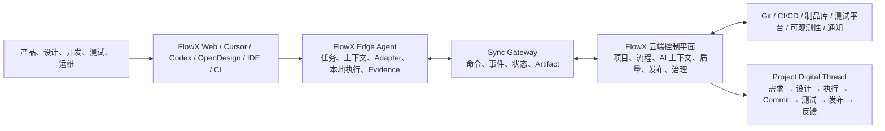
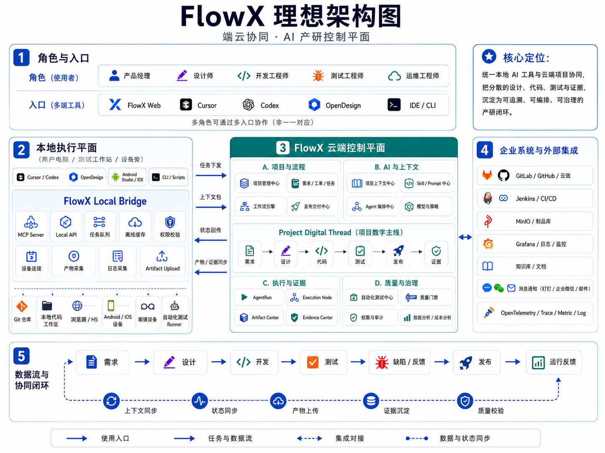

# FlowX

FlowX 是一个正在从 AI 研发流程编排 MVP 演进为端云协同 AI 产研平台的项目。

Cursor、Codex、OpenDesign、IDE、CLI 和自动化测试工具继续作为端侧专业执行环境；FlowX 负责组织级项目、上下文、流程、状态、证据、质量、交付和治理。

## Architecture



完整目标架构、同步协议、数据模型和 90 天实施路线见 [FlowX 端云协同 AI 产研平台目标架构](docs/architecture/edge-cloud-ai-rd-platform.md)。



### 当前已具备的基础

1. `Workspace`、`Project`、`Requirement`、排期和项目简报。
2. 一条工作流内的产品构思、设计、任务拆分、技术方案、执行、AI Review 和人工确认。
3. Codex、Cursor、Mock executor 抽象，以及 OpenDesign 本地设计会话。
4. Cursor Extension、`flowx-local`、本地执行交接、可靠 Outbox 和本地完成回传。
5. Workflow Repository、工作分支、Artifact 和本地预览。
6. ReviewFinding、Issue、Bug、每日 Code Review 和投递目标。
7. 部署 Provider、Git 凭据、AI 凭据、认证和组织用户管理。

### 目标演进方向

1. 将 `flowx-local` 演进为统一 FlowX Edge Agent。
2. 通过 Tool Adapter SPI 接入 Cursor、Codex、OpenDesign、测试 Runner 和设备节点。
3. 建立版本化、幂等、可追踪的端云同步协议。
4. 建立独立测试与质量中心以及统一 Artifact/Evidence Center。
5. 用 Project Digital Thread 串联需求、设计、执行、代码、测试、发布和运行反馈。
6. 在保持模块化单体的前提下，逐步引入 PostgreSQL、队列、对象存储和独立 Worker。

## Stack

- Backend: NestJS + TypeScript + Prisma + SQLite（当前 MVP）
- Frontend: React + shadcn/ui + Tailwind + Vite
- Local integration: Cursor Extension + `flowx-local` + OpenDesign Adapter
- AI integration: Codex / Cursor / Mock executor + OpenDesign
- Target infrastructure: PostgreSQL + Redis/BullMQ + MinIO/S3 + Workers

## Engineering guardrails

- Agent rules: `AGENTS.md`
- AI maintainability guide: `docs/architecture/ai-maintainability.md`
- Validation command: `pnpm check`

## Structure

- `docs/system-design.md`: 当前系统设计与目标演进索引
- `docs/architecture/edge-cloud-ai-rd-platform.md`: 端云协同目标架构、协议和实施路线
- `docs/superpowers/plans/2026-07-22-edge-cloud-foundation.md`: 第一阶段端云协同底座实施计划
- `docs/docker-deployment.md`: Docker 与 Nginx 部署指南
- `docs/deploy-integration-design.md`: 部署集成设计与扩展方案
- `apps/api`: backend service
- `apps/web`: basic management UI
- `prisma`: Prisma schema

## Quick start

1. Create `.env` in the repository root:

```env
DATABASE_URL="file:./dev.db"
PORT=3000
VITE_API_BASE_URL="http://localhost:3000"
DINGTALK_APP_ID=""
DINGTALK_APP_SECRET=""
DINGTALK_AGENT_ID=""
```

1. Install dependencies:

```bash
pnpm install
```

1. Generate Prisma client and sync schema:

```bash
pnpm prisma:generate
pnpm --filter flowx-api exec prisma db push --schema ../../prisma/schema.prisma
```

1. Start both apps:

```bash
pnpm dev
```

### 本地 OpenDesign 设计

新架构下，OpenDesign 在设计师本机运行，不需要安装到 FlowX API 主机：

```text
Personal API Token（设置页或 flowx-local login）→ flowx_list_tasks / bind
→ 构思 submit → 同一会话设计 handoff / submit → FlowX 设计确认
```

推荐路径：在 Web「设置」→ API Token（`/settings/api-tokens`）生成 `fxpat_…`，执行 `flowx-local login --token …`，再用 MCP 领取任务；Web「打开本地 OpenDesign」为可选兜底。完整说明见
[OpenDesign 本地设计阶段](docs/opendesign-design-stage.md)和
[本地 Agent 使用指南](docs/local-agent-guide.md)。

先安装并启动本地 Agent：

```bash
npm install -g @flowx-ai/local
flowx-local setup
flowx-local login --token fxpat_…
flowx-local serve
```

Monorepo 贡献者：`pnpm --filter @flowx-ai/local build && pnpm flowx-local serve`。

本地任务目录可能写入 `~/.flowx/design-sessions/<executionSessionId>/`。也可用 MCP `flowx_submit_design`，或执行：

```bash
flowx-local design-submit <executionSessionId>
flowx-local sync
```

如果 OpenDesign 有可直接启动的命令，可在 `~/.flowx/local.json` 配置：

```json
{
  "openDesignCommand": "/absolute/path/to/opendesign"
}
```

macOS 未配置时，会自动尝试打开 `/Applications/Open Design.app`。请在 Open Design 内选择
自己的项目目录，并在 Cursor Agent 的 MCP 配置中使用 `flowx-local mcp`
（`flowx_list_tasks` / `flowx_bind_workflow` / `flowx_get_*_handoff` / `flowx_submit_*`）。运维说明见
[Edge Agent 运维说明](docs/edge-agent-operations.md)。

## Deploy integration

FlowX now includes an isolated deploy integration module for repository-level CI/CD adapters.

- Provider abstraction lives under [apps/api/src/deploy](/Users/chalkley/workspace/FlowX/apps/api/src/deploy)
- Design document: [docs/deploy-integration-design.md](/Users/chalkley/workspace/FlowX/docs/deploy-integration-design.md)
- Default provider is `noop`
- Real providers can be selected with `DEPLOY_PROVIDER`

Example API environment variables for Rokid OPS:

```env
DEPLOY_PROVIDER=rokid-ops
DEPLOY_ROKID_OPS_CREATE_JOB_URL=http://ops-manage.rokid-inc.com/api/cicd/app/createJob
DEPLOY_PROVIDER_TIMEOUT_MS=10000
```

## Docker deployment

完整部署说明见 [docs/docker-deployment.md](/Users/chalkley/workspace/FlowX/docs/docker-deployment.md)。

This repo includes a multi-stage `Dockerfile` that builds both the API and the web app.

Build the image:

```bash
docker build \
  --build-arg VITE_API_BASE_URL="/api" \
  -t flowx:latest .
```

Run the container:

```bash
docker run -d \
  --name flowx \
  -p 3000:3000 \
  -p 4173:4173 \
  -e PORT=3000 \
  -e WEB_PORT=4173 \
  -e DATABASE_URL="file:/data/dev.db" \
  -e AI_EXECUTOR_PROVIDER="mock" \
  -e OPENAI_API_KEY="your_openai_api_key" \
  -e CODEX_HOME="/data/.codex" \
  -e DINGTALK_APP_ID="your_app_id" \
  -e DINGTALK_APP_SECRET="your_app_secret" \
  -e GIT_AUTHOR_NAME="FlowX Bot" \
  -e GIT_AUTHOR_EMAIL="flowx@example.com" \
  -v flowx-data:/data \
  flowx:latest
```

Notes:

- API runs on `3000`
- Web runs on `4173`
- SQLite data is stored in `/data/dev.db`, so mounting `/data` is recommended
- The container startup script will run `prisma db push` automatically before starting services
- The runtime image now installs both Codex CLI and Cursor CLI
- Codex login state is stored under `/data/.codex` by default, so mounting `/data` will persist `codex login`
- `AI_EXECUTOR_DEFAULT_PROVIDER` can be set to `codex` or `cursor` as the default provider for new workflows
- If you want to use `AI_EXECUTOR_PROVIDER="codex"`, set `OPENAI_API_KEY` in the container
- If you want to use Cursor on the server, set `CURSOR_API_KEY` in the container and choose `Cursor CLI` when starting a workflow
- If you want each user to use their own Cursor API Key, set `FLOWX_CREDENTIAL_MASTER_KEY` and let users configure credentials in `AI 凭据` page
- If you want to enforce user-only Cursor credentials (no instance fallback), set `FLOWX_CURSOR_REQUIRE_USER_CREDENTIAL=true`
- If you want each user to use their own Codex/OpenAI API Key, set `FLOWX_CREDENTIAL_MASTER_KEY` and let users configure credentials in `AI 凭据` page
- If you want to enforce user-only Codex credentials (no instance fallback), set `FLOWX_CODEX_REQUIRE_USER_CREDENTIAL=true`
- If you want workflow `提交并推送到远程` to work, the container must have:
  - reachable git remote credentials (SSH key or HTTPS token)
  - git identity configured, e.g. `GIT_AUTHOR_NAME` and `GIT_AUTHOR_EMAIL`
- `AI_EXECUTOR_PROVIDER="codex"` still requires valid Codex authentication in the container; in server environments the simplest way is `OPENAI_API_KEY`
- If Docker/host kernel blocks Codex `read-only` sandbox with `bwrap: No permissions to create a new namespace`, set `CODEX_READ_SANDBOX="danger-full-access"`
- OpenDesign 推荐通过设计师本机的 `flowx-local` Adapter 接入；API 主机上的 `OPENDESIGN_MCP_ENABLED` 仅保留为旧服务端 AI 设计链路的兼容能力。见 [docs/opendesign-design-stage.md](/Users/chalkley/workspace/FlowX/docs/opendesign-design-stage.md)

### Using manual `codex login` in Docker

If you are still in a personal-use stage and prefer logging into Codex manually instead of configuring `OPENAI_API_KEY`, you can:

1. Start the container with `AI_EXECUTOR_PROVIDER="codex"` and mount `/data`
2. Enter the container once and run `codex login`
3. Keep using the same `/data` volume so `/data/.codex` persists across restarts

Example:

```bash
docker run -d \
  --name flowx \
  -p 3000:3000 \
  -p 4173:4173 \
  -e PORT=3000 \
  -e WEB_PORT=4173 \
  -e DATABASE_URL="file:/data/dev.db" \
  -e AI_EXECUTOR_PROVIDER="codex" \
  -e CODEX_HOME="/data/.codex" \
  -v flowx-data:/data \
  flowx:latest

docker exec -it flowx sh
codex login
```

After login succeeds once, the Codex auth state will stay in the mounted volume.

### Deploy behind Nginx

If you do not want to expose `3000` and `4173` directly, you can put Nginx in front and expose only port `80`.

1. Build the image with same-origin API requests:

```bash
docker build \
  --build-arg VITE_API_BASE_URL="/api" \
  -t flowx:latest .
```

1. Start with the provided compose file:

```bash
docker compose -f docker-compose.nginx.yml up -d
```

This setup will:

- expose only `80`
- proxy `/api/*` to the API container
- proxy all other paths to the web app

If you are using manual `codex login`, run it once after the containers start:

```bash
docker exec -it flowx sh
codex login
```

## Auth

- Built-in user system with extensible third-party provider abstraction.
- Supports account/password login and registration.
- DingTalk login is available at `/api/auth/dingtalk/*` when deployed behind Nginx.
- For real DingTalk OAuth, set `DINGTALK_APP_ID`, `DINGTALK_APP_SECRET`, and optionally override endpoints via:
  - `DINGTALK_AUTHORIZE_URL`
  - `DINGTALK_TOKEN_URL`
  - `DINGTALK_PROFILE_URL`
  - `DINGTALK_ORGS_URL`
- For personal stage completion notifications, also set `DINGTALK_AGENT_ID`.
- FlowX will try to notify only the current DingTalk login user who triggered the stage or confirmation, instead of broadcasting through a group robot.

## MVP flow

1. Create requirement
2. Start workflow
3. Run task split
4. Human confirm or reject task split
5. Run technical plan
6. Human confirm or reject plan
7. Run execution
8. Run AI review
9. Inspect full stage history
