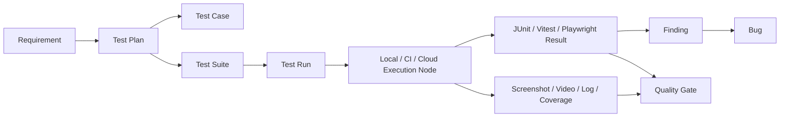
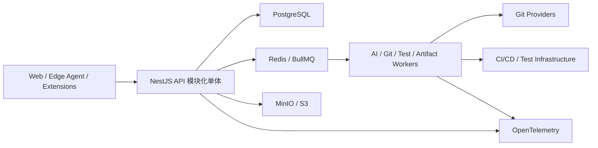

# FlowX 端云协同 AI 产研平台目标架构

> 文档状态：目标架构基线
> 更新日期：2026-07-22
> 适用范围：FlowX 产品规划、领域建模、端云协议、模块拆分和后续实施计划

## 1. 定位

FlowX 的目标不是替代 Cursor、Codex、OpenDesign、IDE、CLI 或自动化测试工具，而是成为这些端侧工具之上的组织级 AI 产研控制平面。

- 端侧工具负责专业执行：编辑代码、生成设计、运行测试、操作设备和本地调试。
- FlowX 负责组织协同：项目、需求、上下文、流程、状态、证据、质量、交付和治理。
- Git 继续作为源代码事实来源，FlowX 默认不复制完整本地工作区。
- FlowX API 和数据库是组织级流程状态的事实来源，MCP、插件和 Local API 只承担接入与同步职责。

## 2. 展示架构图


上图用于方案汇报和总体沟通。下方 Mermaid 图是可版本化维护的权威架构源，模块名称和依赖关系以 Mermaid 与本文定义为准。

## 3. 权威架构图

```mermaid
flowchart TB
    Roles["产品经理、设计师、开发工程师、测试工程师、运维工程师"]

    subgraph Entrances["1. 角色与多工具入口"]
        Web["FlowX Web"]
        Cursor["Cursor Extension"]
        Codex["Codex Skill / CLI / MCP"]
        OpenDesign["OpenDesign"]
        IDE["IDE / CLI"]
        Bot["CI/CD Bot"]
    end

    subgraph Edge["2. FlowX Edge Agent（端侧执行平面）"]
        Inbox["任务收件箱与认领"]
        ContextPackage["上下文包管理"]
        AdapterSPI["Tool Adapter SPI"]
        RepoMap["仓库与分支映射"]
        LocalRunner["本地命令与测试 Runner"]
        Collector["Artifact / Evidence 采集"]
        OfflineQueue["离线队列与可靠重试"]
        DeviceSecurity["设备认证与密钥隔离"]

        AdapterSPI --> CursorAdapter["Cursor Adapter"]
        AdapterSPI --> CodexAdapter["Codex Adapter"]
        AdapterSPI --> DesignAdapter["OpenDesign Adapter"]
        AdapterSPI --> ShellAdapter["Shell Adapter"]
        AdapterSPI --> TestAdapter["Test Runner Adapter"]
        AdapterSPI --> DeviceAdapter["Device Adapter"]
    end

    subgraph Sync["3. 端云同步层 Sync Gateway"]
        Command["任务与命令下发"]
        ContextSync["上下文同步"]
        EventSync["事件与状态回传"]
        ArtifactSync["产物与证据上传"]
        Reliability["版本化协议、幂等、签名、Trace、断线重传"]
    end

    subgraph Cloud["4. FlowX 云端控制平面"]
        PM["项目管理中心\n项目组合、需求池、排期与资源、风险与依赖、项目简报"]
        Workflow["研发流程中心\n流程模板、任务图、多 Agent 编排、人工门禁、重试与恢复"]
        AIContext["AI 上下文中心\n项目上下文、Prompt / Skill 版本、技术决策、模型与成本策略"]
        Quality["测试与质量中心\n测试计划、用例、Test Run、Code Review、缺陷、质量门禁"]
        Delivery["发布与运维中心\n环境、版本、部署、灰度、回滚、运行反馈"]
        Governance["治理与度量中心\n权限、审计、设备、凭据、研发效能、AI 成本与合规"]
    end

    subgraph Integrations["5. 企业系统与外部集成"]
        Git["GitLab / GitHub"]
        CI["Jenkins / CI/CD"]
        ObjectStorage["MinIO / 制品库"]
        TestInfra["自动化测试平台 / 设备农场"]
        Observability["OpenTelemetry / Grafana"]
        Knowledge["知识库 / 文档"]
        Messaging["钉钉 / 企业微信 / 邮件"]
    end

    subgraph Thread["6. Project Digital Thread（项目数字主线）"]
        Lifecycle["需求 → 设计 → 任务 → 本地 / 云端执行 → Artifact / Evidence → Commit / MR → 自动化测试 → Finding / Bug → 发布 → 运行反馈"]
        Traceability["上下文同步、状态同步、产物沉淀、证据追踪、质量校验、全链路审计"]
    end

    Roles --> Entrances
    Entrances --> Edge
    Edge <--> Sync
    Sync <--> Cloud
    Cloud <--> Integrations
    Cloud --> Thread
```



## 4. 架构原则

### 4.1 Local-first execution，cloud-authoritative state

开发、设计、调试和部分测试优先复用用户本机的工具、仓库、环境和凭据；FlowX 云端保存任务状态、上下文版本、执行记录、证据索引和治理数据。

### 4.2 一个 Edge Agent，多种 Tool Adapter

不继续扩展互相独立的 `cursor-local`、`codex-local`、`opendesign-local` 业务链路。`flowx-local` 应逐步演进为通用 `FlowX Edge Agent`，各工具通过 `Tool Adapter SPI` 接入。

建议接口：

```ts
interface ToolAdapter {
  capabilities(): ToolCapability[];
  prepareContext(task: TaskContext): Promise<ContextPackage>;
  start(session: ExecutionSession): Promise<void>;
  collectProgress(): Promise<ProgressEvent[]>;
  collectArtifacts(): Promise<ArtifactManifest[]>;
  complete(): Promise<CompletionReport>;
  cancel(): Promise<void>;
}
```

首批 Adapter：

- `CursorAdapter`
- `CodexAdapter`
- `OpenDesignAdapter`
- `ShellAdapter`
- `TestRunnerAdapter`
- `DeviceAdapter`

### 4.3 端云协议优先于工具专用 API

所有端侧工具共享统一的任务、事件、Artifact 和 Evidence 协议。工具差异由 Adapter 消化，云端业务模块不直接依赖 Cursor、Codex 或 OpenDesign 的专有结构。

### 4.4 Project Digital Thread 贯穿全生命周期

每一条需求都应该可以追溯到设计、任务、执行会话、代码变更、测试结果、缺陷、发布和运行反馈。数字主线不是单独页面，而是各领域对象之间稳定的 Trace 关系。

### 4.5 模块化单体优先

目标架构是领域边界，不代表立即拆成微服务。近期继续保持 NestJS 模块化单体；只把 AI 执行、仓库操作、测试运行、Artifact 处理等长耗时任务放入独立 Worker。

## 5. 分层职责

### 5.1 角色与多工具入口

| 入口 | 主要职责 |
| --- | --- |
| FlowX Web | 项目管理、流程查看、人工确认、质量和发布决策 |
| Cursor Extension | 任务选择、仓库匹配、Chat 交接、完成报告 |
| Codex Skill / CLI / MCP | 获取任务上下文、执行开发任务、上报结果 |
| OpenDesign | 设计探索、设计 Artifact 生成与反馈迭代 |
| IDE / CLI | 人工开发、本地命令、调试和专用工具接入 |
| CI/CD Bot | 自动执行构建、测试、审查、部署和状态回传 |

入口只负责角色体验，不拥有组织级业务状态。

### 5.2 FlowX Edge Agent

Edge Agent 是运行在用户电脑、测试工作站或设备节点上的可信本地代理，负责：

- 设备注册、登录态交换和短期凭据。
- 本地仓库 URL、路径、分支和 FlowX Repository 的映射。
- 下载任务上下文包并交给指定 Adapter。
- 收集分支、Commit、变更文件、测试结果和执行摘要。
- 上传 Artifact/Evidence，处理断网缓存、幂等重试和恢复。
- 在用户明确授权后执行 Push、测试、构建或设备操作。

Edge Agent 不应：

- 成为第二套工作流数据库。
- 持久化不必要的完整源码或敏感 Diff。
- 在无用户授权时执行破坏性 Git 操作。
- 把本地路径暴露为云端服务器可访问路径。

### 5.3 Sync Gateway

同步层提供四类标准流量：

1. 任务与命令下发：任务认领、取消、重试、执行测试、收集证据。
2. 上下文同步：需求、验收标准、设计稿、仓库规则、Prompt、Skill。
3. 事件与状态回传：进度、阶段状态、阻塞原因、心跳和能力变化。
4. 产物与证据上传：设计稿、测试报告、截图、视频、日志、覆盖率和 Commit 引用。

建议统一事件信封：

```ts
interface FlowXSyncEvent<TPayload = unknown> {
  eventId: string;
  schemaVersion: string;
  organizationId: string;
  workspaceId: string;
  projectId?: string;
  actorId: string;
  deviceId: string;
  sourceTool: string;
  traceId: string;
  entityType: string;
  entityId: string;
  eventType: string;
  payload: TPayload;
  occurredAt: string;
  idempotencyKey: string;
}
```

协议要求：

- 所有写入操作必须支持幂等。
- 事件和 Artifact schema 必须带版本。
- 大文件通过预签名 URL 上传，不直接穿过主 API 进程。
- 本地重试不能导致重复完成工作流或重复创建缺陷。
- `traceId` 应贯穿任务、执行、测试、发布与通知。

### 5.4 云端六大中心

| 中心 | 近期复用模块 | 目标能力 |
| --- | --- | --- |
| 项目管理中心 | `projects`、`requirements`、`schedule`、`briefings` | 项目组合、需求池、里程碑、资源、依赖、风险和简报 |
| 研发流程中心 | `workflow`、`requirements` ideation | 流程模板、任务图、多 Agent、人工门禁、恢复和 SLA |
| AI 上下文中心 | `ai`、`prompts`、工作流 Artifact | 项目上下文、Prompt/Skill 版本、技术决策、模型和成本策略 |
| 测试与质量中心 | `daily-code-review`、`review-artifacts` | Test Plan/Case/Run、Evidence、Code Review、缺陷和质量门禁 |
| 发布与运维中心 | `deploy`、`dev-preview` | 环境、版本、部署、灰度、回滚和运行反馈 |
| 治理与度量中心 | `auth`、凭据、投递日志 | 权限、设备、审计、配额、成本、效能和合规 |

### 5.5 企业集成中心

外部系统应通过统一 Provider/Connector 边界接入，避免业务服务直接散落第三方 API 调用。

首批集成方向：

- Git：GitLab、GitHub 和企业 Git 服务。
- CI/CD：Jenkins、GitLab CI、GitHub Actions 和企业发布平台。
- Artifact：MinIO、S3、制品库。
- 测试基础设施：浏览器集群、设备农场、自动化测试平台。
- 可观测性：OpenTelemetry、Grafana、日志和告警平台。
- 协作通知：钉钉、企业微信、邮件。
- 知识系统：Wiki、文档库、技术知识库。

## 6. 数据所有权与数字主线

| 数据 | 事实来源 | FlowX 保存内容 |
| --- | --- | --- |
| 项目、需求、流程状态 | FlowX | 完整结构化数据和历史记录 |
| 源代码 | Git remote / 本地 Git | Repository、Branch、Commit、MR 引用和摘要 |
| 端侧执行 | FlowX | `ExecutionSession`、进度事件、完成报告和 Trace |
| 大型 Artifact | Object Storage | 元数据、版本、校验和、权限和对象引用 |
| 测试结果 | FlowX + Object Storage | 结构化结果、汇总、Evidence 和原始报告引用 |
| 部署状态 | 部署 Provider + FlowX | Provider 状态、环境、版本、审批和回调记录 |
| 运行指标 | Observability Provider | 指标摘要、告警和关联 Trace 引用 |

数字主线建议以显式关联对象表达，不依赖在 JSON 中拼装隐式关系：

```text
Requirement
  -> WorkItem / Task
  -> WorkflowRun / StageExecution
  -> ExecutionSession
  -> Artifact / Evidence
  -> ChangeSet / Commit / MergeRequest
  -> TestRun / Finding / Bug
  -> Release / Deployment
  -> RuntimeFeedback
```

## 7. 测试与质量中心

测试是独立领域，不只是工作流中的一个阶段。



第一阶段支持范围：

- Vitest、Jest、JUnit 测试结果导入。
- Playwright 测试、截图、视频和 Trace 上传。
- 本地、CI、云端 Runner 三种执行位置。
- 测试结果与 Requirement、WorkflowRun、Commit 自动关联。
- 失败测试生成待确认 Finding，确认后转为 Bug。
- 发布门禁校验必测用例、阻断缺陷、覆盖率和人工审批。

## 8. 目标技术部署

### 8.1 近期形态



当前 SQLite 继续服务本地开发和 MVP 验证。进入多实例部署、可靠队列、并发 Worker 和企业审计阶段前，应迁移到 PostgreSQL。

### 8.2 暂不实施

- 不按六大中心立即拆分六个微服务。
- 不引入复杂的跨服务分布式事务。
- 不在 FlowX 内复制 Git、CI、Artifact 或 Observability 的全部能力。
- 不承诺后台完全自治执行取代用户的本地工具体验。

## 9. 数据模型演进

现有 `Workspace`、`Project`、`Requirement`、`WorkflowRun`、`StageExecution`、`WorkflowRepository`、`Issue`、`Bug`、`ReviewFinding`、`DeployJobRecord` 保留并逐步演进。

建议新增或抽象：

| 领域 | 目标对象 |
| --- | --- |
| 端侧管理 | `ClientInstallation`、`Device`、`DeviceCredential`、`ToolCapability` |
| 同步 | `SyncEvent`、`Command`、`CommandAttempt`、`EventCheckpoint` |
| 执行 | `ExecutionSession`、`ExecutionNode`、`ExecutionProgress` |
| 产物与证据 | `Artifact`、`ArtifactVersion`、`Evidence`、`EvidenceLink` |
| 测试 | `TestPlan`、`TestCase`、`TestSuite`、`TestRun`、`TestResult` |
| 发布 | `Environment`、`Release`、`Deployment`、`RuntimeFeedback` |
| AI 资产 | `PromptVersion`、`SkillVersion`、`ContextPackage`、`DecisionRecord` |
| 治理 | `Policy`、`QualityGate`、`AuditLog`、`UsageRecord` |

`WorkflowRun/StageExecution` 表示业务流程及阶段；`ExecutionSession` 表示某个 Adapter、Agent、Worker 或测试节点进行的一次真实执行。两者不能混为同一个生命周期。

## 10. 90 天实施路线

### 阶段一：统一端云底座，0～4 周

- 将 `flowx-local` 定义为未来 Edge Agent 的承载包。
- 从 `cursor-local` 和本地执行交接中抽取通用任务、上下文和完成报告契约。
- 定义 `ExecutionSession`、`SyncEvent`、`Artifact`、`Evidence` 的最小模型。
- 增加幂等键、离线草稿、可靠重试、短期设备凭据和 Trace。
- 保持现有 Cursor Extension API 兼容。
- 打通需求认领、本地开发、Push、回传、Review 的黄金链路。

### 阶段二：多工具协同，5～8 周

- 实现 Cursor、Codex、OpenDesign 三个 Adapter。
- 建立统一任务收件箱、设备能力注册和执行会话视图。
- 设计稿、代码报告、测试报告统一进入 Artifact/Evidence Center。
- 建立项目上下文包、Prompt/Skill 版本和技术决策记录。
- 在项目详情页展示 Project Digital Thread。

### 阶段三：测试与质量闭环，9～12 周

- 上线 Test Plan、Test Case、Test Suite、Test Run。
- 接入 Playwright、Vitest/JUnit 和 Jenkins/GitLab CI。
- 建立质量门禁、Finding 归并和 Bug 转换流程。
- 串联部署 Provider、环境、版本、审批和发布记录。
- 增加项目进度、质量趋势、研发效能和 AI 成本视图。

### 后续阶段

- PostgreSQL、多实例 API 和独立 Worker 扩展。
- 企业级组织隔离、细粒度权限、审计和配额。
- 设备农场、移动端测试、灰度发布和运行反馈关联。
- Agent/Skill 市场、智能任务路由和跨项目知识复用。

## 11. MVP 黄金链路

第一轮实施必须优先验证一条完整链路：

1. 产品经理在 FlowX 创建并排期需求。
2. 设计师在 OpenDesign 完成设计，设计 Artifact 同步到 FlowX。
3. 开发人员从 Cursor 或 Codex 认领任务，在本地仓库工作。
4. Edge Agent 回传分支、Commit、变更摘要、测试结果和 Evidence。
5. CI 或测试人员执行自动化测试，失败结果沉淀为 Finding/Bug。
6. 质量门禁通过后触发发布，并记录环境、版本和部署结果。
7. 运行指标和反馈回流项目简报与数字主线。

验收标准：

- 同一任务可以从 FlowX Web、Cursor 或 Codex 获取一致上下文。
- 端侧断网或重复提交不会产生重复完成、重复 Artifact 或重复 Bug。
- Requirement 可以追溯到设计、执行、Commit、测试和发布。
- 代码不需要上传到 FlowX 才能完成端云协同。
- 本地执行和云端执行最终进入同一工作流审查与人工确认路径。

## 12. 后续开发约束

- 新工具接入优先实现 Adapter，不新增平行的工具专用工作流状态机。
- 新增端云接口前先判断是否应成为版本化同步协议的一部分。
- Artifact、Evidence、事件和命令必须考虑权限、幂等、版本和保留策略。
- 云端与本地执行必须共享工作流状态机和完成校验逻辑。
- 规划能力未实现前，产品文案和用户手册必须标记为规划或实验能力。
- 修改工作流、Prisma、认证、凭据、测试与发布领域时，遵循仓库高风险区域的测试优先规则。
