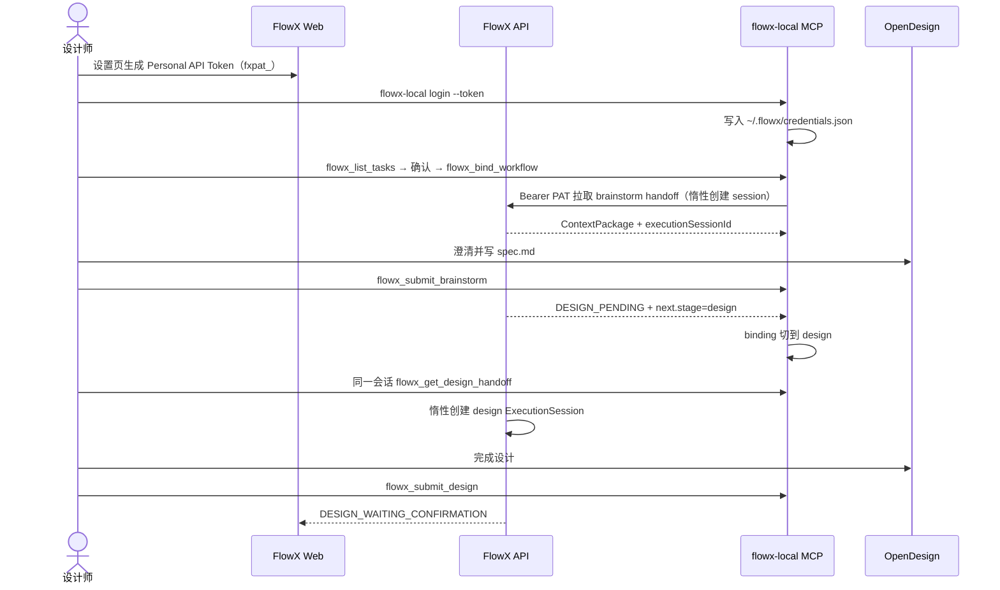

# OpenDesign 本地设计阶段

FlowX 的推荐 OpenDesign 链路是端云协同，而不是由服务端 Codex/Cursor 间接调用 OpenDesign MCP：

```text
Web 设置生成 Personal API Token（fxpat_…）或 flowx-local login --token
→ MCP flowx_list_tasks → 用户确认 → flowx_bind_workflow
→ 本地 OpenDesign 构思（handoff → spec.md → submit）
→ 同一会话立刻设计 handoff（惰性创建 ExecutionSession）→ 设计 → submit
→ Artifact / Evidence / CompletionReport 回传 FlowX
→ 工作流进入 DESIGN_WAITING_CONFIRMATION
```

全程**不需要**第二次点击 Web「打开本地 OpenDesign」。Web 一键启动仍保留，作为未配置长期 token 时的可选兜底。

## 推荐金路径（Personal API Token）

1. **本机鉴权**
   - 在 FlowX Web「设置」→ [API Token](/settings/api-tokens)（路由 `/settings/api-tokens`）生成长期 Personal API Token（明文前缀 `fxpat_`，仅创建时显示一次），或
   - 执行 `flowx-local login --token <fxpat_…>`（也可交互粘贴），写入 `~/.flowx/credentials.json`（权限 `0600`）。
   - 亦可设置环境变量 `FLOWX_API_TOKEN`。Token 与浏览器登录用户同权，默认不过期；可在设置页撤销。
2. **安装并配置 MCP**：`flowx-local setup`，在 Cursor / Codex 中配置 `flowx-local mcp`。
3. **领取任务**：Agent 调用 `flowx_list_tasks` 列出可构思 / 可设计的工作流 → 与用户确认一条 → `flowx_bind_workflow` 写入 `~/.flowx/current-workflow.json`（含 `workflowRunId`、stage 等；**不含** token）。
4. **产品构思**：`flowx_get_brainstorm_handoff` → 澄清并写 `spec.md` → 用户确认后 `flowx_submit_brainstorm`。
5. **同一会话进入设计**：submit 成功响应带 `next.stage=design`（及 hint）；本地 binding 切到 `design`。立刻调用 `flowx_get_design_handoff`（服务端按需惰性创建 design `ExecutionSession`）→ 完成设计 → `flowx_submit_design`。
6. Web 进入 `DESIGN_WAITING_CONFIRMATION`，人工确认设计方案。

### MCP 鉴权顺序

1. `process.env.FLOWX_API_TOKEN`
2. `~/.flowx/credentials.json`
3. 活跃 `~/.flowx/active-design.json` 中的短期 `accessToken`（兼容旧路径）

无凭据时会提示 login / 配置 token /（可选）从 Web 打开本地 OpenDesign。

### Binding 解析

工具参数中的 `workflowRunId` / `executionSessionId` 优先 → 否则读 `current-workflow.json` → 再否则提示先 `flowx_list_tasks` 并 `flowx_bind_workflow`。Binding 不是权限源；API 始终按 token 对应用户授权。

## 架构与数据流



核心约束：

- FlowX 是需求、工作流状态、版本化上下文、Artifact 和 Evidence 的事实来源。
- OpenDesign 是设计师本地的专业执行环境；**项目目录由设计师在 Open Design 内自行选择**。
- Personal API Token 存本机 `credentials.json` 或环境变量，不进 Outbox payload、结构化日志、git 或项目目录。
- 服务端仍用 `ExecutionSession` 记账与回传；设计阶段在 design handoff 时惰性创建（submit 亦可兜底补建）。
- 推荐在 Cursor / Codex 的 MCP 配置中使用 `flowx-local mcp`：`flowx_get_*_handoff` 拉取 ContextPackage，`flowx_submit_*` 回传结果。
- 结果通过 `idempotencyKey` 幂等回传；网络失败时写入 Outbox，恢复后重放。

## 可选兜底：Web「打开本地…」

未配置长期 token 时，仍可走短期会话路径：

1. 本机保持 `flowx-local serve`。
2. 在工作流详情的 `产品构思` / `设计方案` 阶段点击 `打开本地构思` 或 `打开本地 OpenDesign`。
3. 浏览器向本机 `127.0.0.1:3920` 发送一次性启动票据；兑换后写入 `~/.flowx/active-design.json` 与 `design-sessions/<executionSessionId>/`。
4. MCP 从活跃短期会话读取凭据，继续 handoff / submit。

该路径与 Personal Token 主路径兼容，但构思提交后通常仍需再次点击「打开本地 OpenDesign」才能进入设计短期会话；金路径下应避免依赖第二次点击。

## 启动 flowx-local

先安装、安装构思 Skill，再按需启动本机 Agent（Web 一键启动 / Outbox 同步需要 `serve`；纯 MCP + PAT 金路径以 `mcp` 与 credentials 为主）：

```bash
npm install -g @flowx-ai/local
flowx-local setup
flowx-local login --token fxpat_…
# 可选：Web 启动 / sync 时
flowx-local serve
```

产品构思阶段：澄清 → `spec.md` → 用户确认 → `flowx_submit_brainstorm`。会话调试目录优先使用 `spec.md`（兼容旧版 `brainstorm.md`）。

默认监听 `http://127.0.0.1:3920`。检查设备身份与待回传数量：

```bash
flowx-local status
```

登出本机凭据（不强制撤销服务端 token）：

```bash
flowx-local logout
```

不想全局安装时，可用 `npx @flowx-ai/local serve`。

### 开发者

在 FlowX monorepo 内开发 `@flowx-ai/local` 时：

```bash
pnpm --filter @flowx-ai/local build
pnpm flowx-local serve
pnpm flowx-local status
```

## 配置 OpenDesign 启动命令

首次运行后，`flowx-local` 会维护 `~/.flowx/local.json`。将真实 OpenDesign 可执行文件配置为：

```json
{
  "port": 3920,
  "apiBaseUrl": "http://127.0.0.1:3000",
  "openDesignCommand": "/absolute/path/to/opendesign"
}
```

`openDesignCommand` 当前应是单个可执行文件路径，不要附带 shell 参数。未配置时：

- macOS：若存在 `/Applications/Open Design.app`，拉起桌面应用；设计师在 App 内选择自己的项目目录。
- 找不到桌面应用且未配置命令时：不强制打开文件夹作为工程根（会话凭据仍写入 `~/.flowx`）。
- 其他系统：生成会话凭据后按返回信息手工打开 OpenDesign。

推荐在 Cursor / Codex 中配置 `flowx-local mcp`：

```json
{
  "mcpServers": {
    "flowx": {
      "command": "flowx-local",
      "args": ["mcp"]
    }
  }
}
```

Agent 典型调用顺序：`flowx_list_tasks` → `flowx_bind_workflow` → `flowx_get_brainstorm_handoff` / `flowx_get_design_handoff` → `flowx_submit_*`。也可用 `flowx_get_active_design_session` 查看短期会话或「credentials + binding」状态（无短期 session 时不一定报错）。

## 在工作流中发起设计（Web 兜底细节）

1. 在 FlowX `需求` 页面创建需求并启动一条研发工作流。
2. 进入工作流详情，等待仓库 Grounding 完成。
3. （可选）点击 `打开本地构思` / `打开本地 OpenDesign`；`flowx-local` 将任务写入 `~/.flowx/design-sessions/<executionSessionId>/`。
4. 如首次启动时本地 Agent 未运行，可启动后回到同一条工作流重试。重复打开会刷新上下文和短期凭据，但不会覆盖已经编辑的 `result.json`。

本地任务目录（Web 启动或 handoff 写入时）通常包含：

| 文件 | 用途 |
| --- | --- |
| `context.json` | 版本化需求、验收标准、仓库上下文和输出契约 |
| `result.json` | `DesignCompletionReport` 模板，也是最终回传内容 |
| `README.md` | 当前会话的操作说明与回传命令 |
| `session.json` | API 地址与短期会话凭据，权限为 `0600`，不要分享或提交 |

## 完成与回传

在 OpenDesign 完成设计后，将结果写入 `result.json`。必须保留：

```json
{
  "idempotencyKey": "本次设计结果的稳定唯一键",
  "summary": "设计摘要",
  "output": {
    "design": {},
    "demo": {},
    "designArtifact": {
      "html": "<!doctype html><html>...</html>"
    }
  }
}
```

`designArtifact.html` 必须是完整、自包含的 HTML 文档。然后任选一种方式回传：

- 推荐：MCP `flowx_submit_design`
- 或：`flowx-local design-submit <executionSessionId>`
- 或：在工作流详情点击 `回传本地设计`

回传成功后：

- DESIGN Stage 进入待人工确认。
- HTML 设计稿登记为 Artifact，并可在 FlowX 中预览。
- 本次 ExecutionSession 标记为 `COMPLETED`。
- 设计摘要登记为 `AGENT_SUMMARY` Evidence。

## 离线与重试

API 暂时不可用时，完成报告会写入 `~/.flowx/outbox/`，不会静默丢失。检查与重放：

```bash
flowx-local status
flowx-local sync
```

Outbox 不保存 token，只保存 `credentialRef`（如 `executionSessionId`），凭据从对应设计会话的 `session.json` 或本机长期凭据读取。短期 token 过期后不能自动刷新；遇到持续 `401` 时，可改用 Personal API Token 金路径，或在 FlowX 工作流详情重新打开本地 OpenDesign 获取新票据后再同步。已撤销的 PAT 会返回 401/403，不会静默顶替其他用户的短期 session。

## 兼容的旧服务端链路

现有普通 AI 工作流仍可通过 `OPENDESIGN_MCP_ENABLED=1`，让 API 主机上的 Codex/Cursor
在 DESIGN 阶段读取 OpenDesign MCP。这是旧的服务端生成模式，不是本地设计师领取任务的端云链路。
新功能应优先接入 `OpenDesignAdapter`、`ExecutionSession`、Artifact/Evidence 和统一同步协议。

## 相关代码

- 协议：`packages/flowx-protocol/src/design.ts`
- API：`apps/api/src/edge/open-design-edge.controller.ts`、`apps/api/src/workflow/workflow.service.ts`、`apps/api/src/auth/personal-api-token.service.ts`
- 本地 Adapter：`packages/flowx-local/src/adapters/open-design-adapter.ts`
- 本地凭据 / binding / MCP：`packages/flowx-local/src/credentials.ts`、`workflow-binding.ts`、`mcp.ts`
- 本地 HTTP：`packages/flowx-local/src/server.ts`
- Web 入口：`apps/web/src/pages/PersonalApiTokensPage.tsx`、`apps/web/src/pages/WorkflowRunDetailPage.tsx`
