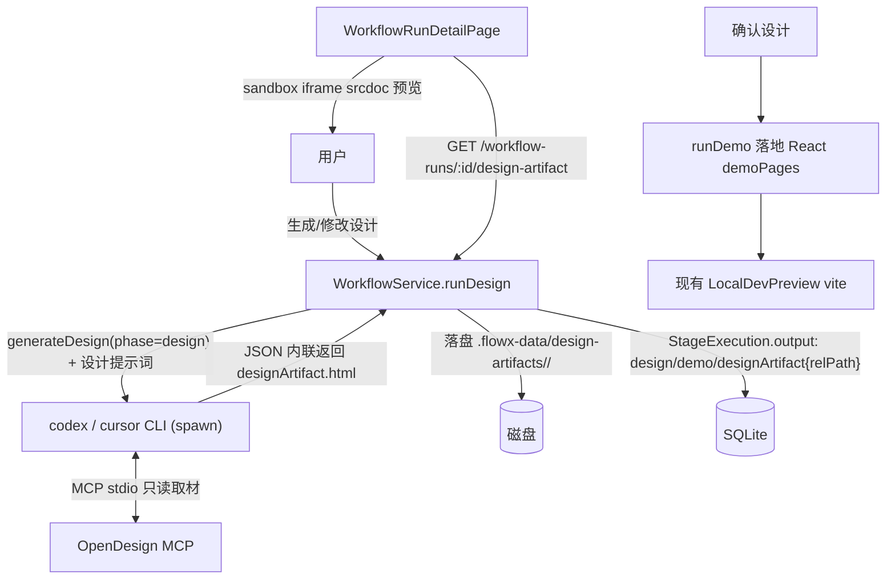

# OpenDesign 接入工作流设计阶段

本文档说明 FlowX 工作流 `DESIGN` / `DEMO` 阶段如何接入 [OpenDesign](https://github.com/nexu-io/open-design)，以及部署时的配置步骤。

## 它做了什么

- `DESIGN` 阶段：现有 `codex` / `cursor` agent 产出一份高保真、自包含的单页 HTML 设计稿（`designArtifact.html`），FlowX 落盘后在 `WorkflowRunDetailPage` 的设计阶段用 sandbox `<iframe srcdoc>` 预览。
- AI Native 修改：复用设计阶段「驳回 / 带反馈重新生成」语义，把人工反馈 + 上一版设计稿喂回 agent 迭代。
- `DEMO` 阶段：把已确认的设计稿 HTML 作为视觉/布局参照，再生成落地到目标仓库的 React `demoPages`（沿用现有 `LocalDevPreview` vite 预览）。

## 架构与数据流



要点：

- 设计阶段的结构化 JSON stage 在 **read-only 沙箱**中运行，agent 不能写仓库文件，因此 HTML 以**内联字段**回传，再由 FlowX 落盘。链路**不依赖 OpenDesign daemon**。
- HTML 落盘到 `.flowx-data/design-artifacts/<workflowRunId>/`，`StageExecution.output` 只存 `designArtifact` 引用（`relPath` / `bytes` / `generatedAt`），不把大 HTML 塞进数据库。
- 无需 Prisma 迁移。

## 部署步骤

在**运行 `flowx-api` 的同一台主机 / 同一容器**上操作（codex/cursor 子进程在这里 `spawn`）：

```bash
# 1) 安装 od CLI（参考 OpenDesign 官方文档）

# 2) 把 OpenDesign MCP 装进你实际使用的 agent
od mcp install codex      # 当 AI_EXECUTOR_PROVIDER=codex
od mcp install cursor     # 当 AI_EXECUTOR_PROVIDER=cursor

# 3) 配置环境变量（仓库根 .env 或容器 -e）
OPENDESIGN_MCP_ENABLED=1
AI_EXECUTOR_PROVIDER=codex   # 或 cursor，且其凭据已配好

# 4) 重启 API（OPENDESIGN_MCP_ENABLED 在进程启动时读取一次）
```

## 注意事项与降级

- **必须重启 API**：`OPENDESIGN_MCP_ENABLED` 在模块加载时读取一次，改了不重启不生效。
- **`od mcp install` 要用 API 进程相同的用户 / `HOME` 执行**：agent 是 FlowX `spawn` 的子进程，读取其 CLI 配置（如 `~/.codex` / cursor 配置）。若 API 跑在某 service account 下，需用该账号安装 MCP。
- **未启用 / 未装 od 也能跑**：
  - 关闭开关或未装 `od`：agent 仍产出自包含 HTML，只是未经 OpenDesign 设计系统取材。
  - `AI_EXECUTOR_PROVIDER=mock`：返回占位 HTML，完全离线（CI/测试走此路）。
- **provider 不能是 mock**：真正接 OpenDesign 时 `AI_EXECUTOR_PROVIDER` 必须为 `codex` 或 `cursor`，且对应凭据（`OPENAI_API_KEY` / `CURSOR_API_KEY` 或登录态）可用。
- **安全**：设计稿 HTML 一律在 `sandbox=""`（无脚本、无同源）iframe 中渲染；落盘读取做了路径穿越防护与大小上限（5MB）。

## 相关代码

- 提示词与 MCP 附加指令：`apps/api/src/prompts/design-generation.prompt.ts`
- 执行器分阶段逻辑与开关：`apps/api/src/ai/codex-ai.executor.ts`、`apps/api/src/ai/cursor-ai.executor.ts`、`apps/api/src/ai/mock-ai.executor.ts`
- 校验与 schema：`apps/api/src/ai/design-output-validate.ts`、`apps/api/src/ai/design-spec.output.schema.json`
- 工作流落盘 / 预览端点：`apps/api/src/workflow/workflow.service.ts`、`apps/api/src/workflow/workflow.controller.ts`
- 前端预览：`apps/web/src/components/DesignArtifactPreview.tsx`、`apps/web/src/pages/WorkflowRunDetailPage.tsx`
