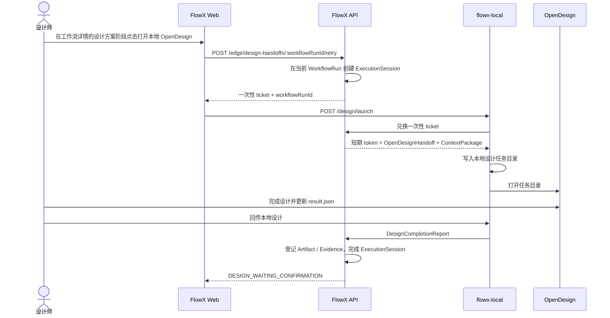

# OpenDesign 本地设计阶段

FlowX 的推荐 OpenDesign 链路是端云协同，而不是由服务端 Codex/Cursor 间接调用 OpenDesign MCP：

```text
FlowX 定义需求
→ 本地 OpenDesign 领取版本化 ContextPackage
→ 本地完成设计
→ Artifact / Evidence / CompletionReport 回传 FlowX
→ 工作流进入 DESIGN_WAITING_CONFIRMATION
```

## 架构与数据流



核心约束：

- FlowX 是需求、工作流状态、版本化上下文、Artifact 和 Evidence 的事实来源。
- OpenDesign 是设计师本地的专业执行环境；**项目目录由设计师在 Open Design 内自行选择**。
- 浏览器只向本机 `127.0.0.1:3920` 发送一次性启动票据；长期登录态不会交给本地工具。
- 推荐在 Cursor / Codex 的 MCP 配置中使用 `flowx-local mcp`，通过 `flowx_get_design_handoff` 拉取 ContextPackage，并通过 `flowx_submit_design` 回传结果。
- `~/.flowx/active-design.json` 保存当前活跃设计会话的短期凭据，供 `flowx-local mcp` 使用。
- `flowx-local mcp` 通过本机 Agent 读取活跃会话，普通用户不需要访问 `~/.flowx`、构建 `flowx-mcp` 或手工复制 token。
- 结果通过 `idempotencyKey` 幂等回传；网络失败时写入 Outbox，恢复后重放。

## 启动 flowx-local

先安装并启动本机 Agent：

```bash
npm install -g @flowx-ai/local
flowx-local serve
```

默认监听 `http://127.0.0.1:3920`。检查设备身份与待回传数量：

```bash
flowx-local status
```

MCP 读取活跃设计会话时会自动通过 `http://127.0.0.1:3920` 请求本机 Agent，用户不需要在 Codex 中手动添加 `--add-dir ~/.flowx`。升级 `flowx-local` 后重启一次本机 Agent，使 loopback 会话接口生效。

不想全局安装时，可用 `npx @flowx-ai/local serve`。

### 开发者

在 FlowX monorepo 内开发 `@flowx-ai/local` 时：

```bash
pnpm --filter @flowx-ai/local build
pnpm flowx-local serve
pnpm flowx-local status
```

## 配置 OpenDesign 启动命令

首次运行后，`flowx-local` 会维护 `~/.flowx/local.json`。将真实 OpenDesign 可执行文件配置为：

```json
{
  "port": 3920,
  "apiBaseUrl": "http://127.0.0.1:3000",
  "openDesignCommand": "/absolute/path/to/opendesign"
}
```

`openDesignCommand` 当前应是单个可执行文件路径，不要附带 shell 参数。未配置时：

- macOS：若存在 `/Applications/Open Design.app`，拉起桌面应用；设计师在 App 内选择自己的项目目录。
- 找不到桌面应用且未配置命令时：不强制打开文件夹作为工程根（会话凭据仍写入 `~/.flowx`）。
- 其他系统：生成会话凭据后按返回信息手工打开 OpenDesign。

推荐在 Cursor / Codex 中配置 `flowx-local mcp`：

1. 在工作流详情的 `设计方案` 阶段点击 `打开本地 OpenDesign`，由 `flowx-local` 写入活跃会话。
2. Agent 调用 `flowx_get_active_design_session` 和 `flowx_get_design_handoff`。
3. 在自有项目中完成设计后调用 `flowx_submit_design`。

## 在工作流中发起设计

1. 在 FlowX `需求` 页面创建需求并启动一条研发工作流。
2. 进入工作流详情，等待仓库 Grounding 完成，并进入 `设计方案` 的 `待设计方案` 状态。
3. 点击该阶段的 `打开本地 OpenDesign`，FlowX 在当前工作流内创建本地执行会话。
4. `flowx-local` 将任务写入 `~/.flowx/design-sessions/<executionSessionId>/`。
5. 如首次启动时本地 Agent 未运行，可启动后回到同一条工作流点击 `打开本地 OpenDesign` 重试。重复打开会刷新上下文和短期凭据，但不会覆盖已经编辑的 `result.json`。

本地任务目录包含：

| 文件 | 用途 |
| --- | --- |
| `context.json` | 版本化需求、验收标准、仓库上下文和输出契约 |
| `result.json` | `DesignCompletionReport` 模板，也是最终回传内容 |
| `README.md` | 当前会话的操作说明与回传命令 |
| `session.json` | API 地址与短期会话凭据，权限为 `0600`，不要分享或提交 |

## 完成与回传

在 OpenDesign 完成设计后，将结果写入 `result.json`。必须保留：

```json
{
  "idempotencyKey": "本次设计结果的稳定唯一键",
  "summary": "设计摘要",
  "output": {
    "design": {},
    "demo": {},
    "designArtifact": {
      "html": "<!doctype html><html>...</html>"
    }
  }
}
```

`designArtifact.html` 必须是完整、自包含的 HTML 文档。然后任选一种方式回传：

```bash
flowx-local design-submit <executionSessionId>
```

或在工作流详情点击 `回传本地设计`。回传成功后：

- DESIGN Stage 进入待人工确认。
- HTML 设计稿登记为 Artifact，并可在 FlowX 中预览。
- 本次 ExecutionSession 标记为 `COMPLETED`。
- 设计摘要登记为 `AGENT_SUMMARY` Evidence。

## 离线与重试

API 暂时不可用时，完成报告会写入 `~/.flowx/outbox/`，不会静默丢失。检查与重放：

```bash
flowx-local status
flowx-local sync
```

Outbox 不保存 token，只保存 `credentialRef=executionSessionId`，凭据从对应设计会话的
`session.json` 读取。当前 MVP 的短期 token 过期后不能自动刷新；遇到持续 `401` 时，需要在
FlowX 工作流详情重新打开本地 OpenDesign，以获得新的启动票据和凭据，再执行同步。

## 兼容的旧服务端链路

现有普通 AI 工作流仍可通过 `OPENDESIGN_MCP_ENABLED=1`，让 API 主机上的 Codex/Cursor
在 DESIGN 阶段读取 OpenDesign MCP。这是旧的服务端生成模式，不是本地设计师领取任务的端云链路。
新功能应优先接入 `OpenDesignAdapter`、`ExecutionSession`、Artifact/Evidence 和统一同步协议。

## 相关代码

- 协议：`packages/flowx-protocol/src/design.ts`
- API：`apps/api/src/edge/open-design-edge.controller.ts`、`apps/api/src/workflow/workflow.service.ts`
- 本地 Adapter：`packages/flowx-local/src/adapters/open-design-adapter.ts`
- 本地 HTTP：`packages/flowx-local/src/server.ts`
- Web 入口：`apps/web/src/pages/RequirementsPage.tsx`、`apps/web/src/pages/WorkflowRunDetailPage.tsx`
