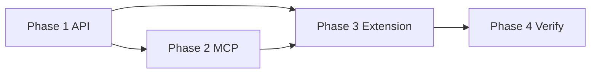

# Cursor Plugin Local Chat Workflow Implementation Plan

> **For agentic workers:** REQUIRED SUB-SKILL: Use superpowers:subagent-driven-development (recommended) or superpowers:executing-plans to implement this plan task-by-task. Steps use checkbox (`- [ ]`) syntax for tracking.
>
> **Human gate:** Approve `docs/superpowers/specs/2026-06-04-cursor-plugin-local-chat-workflow-design.md` before starting.

**Goal:** 在 Cursor 内实现「选任务 → 匹配本地仓库 → 生成 Chat 上下文 → 在 Cursor Chat 开发 → 回传 FlowX」的轻量闭环；FlowX API 仍为状态源，MCP/扩展为薄桥接。

**Architecture:** 后端新增 `LOCAL_CHAT` 工作流快路径（复用 `BUG_FIX` bootstrap 思路，停在 `EXECUTION_PENDING` 且不自动 `runExecution`），统一 `handoff` + `claim-local` + `complete-local`。独立包 `packages/flowx-mcp` 暴露 4 个 MCP tools。`apps/cursor-extension` 提供侧边栏、仓库匹配、剪贴板/Markdown handoff、完成上报；MCP 注册优先文档化 `.cursor/mcp.json`，扩展内注册为可选增强。

**Tech Stack:** NestJS + Vitest（API）、`@modelcontextprotocol/sdk` + Node（MCP）、VS Code Extension API + Vitest（扩展）、现有 `workflow-local-handoff` / `complete-local` / `workflow-git-remote`。

**Design spec:** `docs/superpowers/specs/2026-06-04-cursor-plugin-local-chat-workflow-design.md`

**Builds on:** `docs/superpowers/plans/2026-06-03-local-execution-handoff.md`（`claim-local` / `complete-local` 已实现）

**Out of scope (v1):** 自动 clone、控制 Cursor 原生 Chat 输入、在 MCP 内复制完整状态机、后台无人值守开发、替换 FlowX Web 规划/审查 UI。

---

## File map

| Area | Create | Modify |
|------|--------|--------|
| Workspace | — | `pnpm-workspace.yaml`（增加 `packages/*`） |
| API enums / state machine | — | `apps/api/src/common/enums.ts`, `workflow-state-machine.ts` + spec |
| Local chat bootstrap | `apps/api/src/workflow/local-chat-workflow.bootstrap.ts`, `local-chat-prompt.ts` | `workflow.service.ts`, `workflow.module.ts` |
| Cursor-local API | `apps/api/src/cursor-local/*`（module, controller, service, dto, spec） | `app.module.ts` |
| Complete-local metadata | — | `dto/complete-local-execution.dto.ts`, `workflow-local-execution-output.ts`, spec |
| MCP | `packages/flowx-mcp/**` | 根 `package.json` scripts（可选 `pnpm mcp:dev`） |
| Extension | `apps/cursor-extension/**` | — |
| Docs | `docs/cursor-plugin-local-chat.md`, `docs/cursor-mcp-setup.example.json` | `docs/local-execution-handoff.md`（交叉链接） |

---

## Phase 1 — API: LOCAL_CHAT 快路径与统一 handoff

### Task 1: `WorkflowRunType.LOCAL_CHAT` 与状态机

**Files:**
- Modify: `apps/api/src/common/enums.ts`
- Modify: `apps/api/src/common/workflow-state-machine.ts`
- Modify: `apps/api/src/common/workflow-state-machine.spec.ts`

- [ ] **Step 1: 失败测试**

```typescript
it('allows LOCAL_CHAT bootstrap like BUG_FIX', () => {
  expect(machine.canBootstrapLocalChatWorkflow(WorkflowRunType.LOCAL_CHAT)).toBe(true);
  expect(machine.canBootstrapLocalChatWorkflow(WorkflowRunType.FULL)).toBe(false);
});
```

- [ ] **Step 2: 实现 `canBootstrapLocalChatWorkflow`**

与 `canBootstrapBugFixWorkflow` 并列，`runType === LOCAL_CHAT` 为 true。

- [ ] **Step 3: 运行测试**

```bash
pnpm --filter flowx-api test -- src/common/workflow-state-machine.spec.ts
```

Expected: PASS

- [ ] **Step 4: Commit**

```bash
git add apps/api/src/common/enums.ts apps/api/src/common/workflow-state-machine.ts apps/api/src/common/workflow-state-machine.spec.ts
git commit -m "feat(api): add LOCAL_CHAT workflow run type"
```

---

### Task 2: Local chat prompt + requirement bootstrap 纯函数

**Files:**
- Create: `apps/api/src/workflow/local-chat-workflow.bootstrap.ts`
- Create: `apps/api/src/workflow/local-chat-prompt.ts`
- Create: `apps/api/src/workflow/local-chat-prompt.spec.ts`

- [ ] **Step 1: 失败测试 — requirement prompt**

```typescript
import { buildLocalChatPrompt } from './local-chat-prompt';

it('requirement prompt includes acceptance criteria and completion instructions', () => {
  const prompt = buildLocalChatPrompt({
    taskType: 'requirement',
    taskId: 'req-1',
    workflowRunId: 'wr-1',
    title: 'Add export',
    description: 'Users need CSV export',
    acceptanceCriteria: 'CSV downloads with headers',
    repository: { name: 'flowx-web', url: 'https://github.com/org/flowx-web.git', workingBranch: 'flowx/work/export/abc12345' },
    suggestedChecks: ['pnpm --filter flowx-web test'],
  });
  expect(prompt).toContain('req-1');
  expect(prompt).toContain('Acceptance criteria');
  expect(prompt).toContain('flowx_submit_completion');
});
```

- [ ] **Step 2: 失败测试 — bug prompt**

Assert prompt contains `Reproduction`, `Expected behavior`, `Regression`.

- [ ] **Step 3: 实现 `buildLocalChatRequirementBootstrap`**

复用 `buildBugFixPlanContent` 模式：从 `Requirement` 合成最小 `Task` + `Plan`（summary + implementationPlan 数组），不调用 AI。

```typescript
export function buildLocalChatRequirementBootstrap(requirement: {
  title: string;
  description: string;
  acceptanceCriteria: string;
}) {
  return {
    task: {
      title: requirement.title.trim(),
      description: requirement.description.trim(),
      surface: 'local_chat',
      repositoryNames: [] as string[],
    },
    plan: {
      summary: `本地 Chat 实现：${requirement.title.trim()}`,
      implementationPlan: [
        '在 FlowX 工作分支上完成最小实现。',
        requirement.acceptanceCriteria.trim()
          ? `验收：${requirement.acceptanceCriteria.trim()}`
          : '满足需求描述中的目标行为。',
      ],
      filesToModify: [] as string[],
      newFiles: [] as string[],
      riskPoints: ['保持改动范围与任务一致。'],
    },
  };
}
```

- [ ] **Step 4: 实现 `buildLocalChatPrompt`**

输出 Markdown 文本，末尾固定「完成时调用 MCP `flowx_report_completion` 或扩展 Report to FlowX」说明。

- [ ] **Step 5: 测试 PASS + commit**

---

### Task 3: `applyLocalChatBootstrap` 与 grounding 分支

**Files:**
- Modify: `apps/api/src/workflow/workflow.service.ts`
- Create: `apps/api/src/workflow/workflow-local-chat-bootstrap.spec.ts`

- [ ] **Step 1: 从 `applyBugFixBootstrap` 提取共享 `applyFastPathBootstrap`（可选内联复制，YAGNI 优先复制后小提取）**

`LOCAL_CHAT` 在 `REPOSITORY_GROUNDING` 完成后：
- 跳过 BRAINSTORM/DESIGN/DEMO/TASK_SPLIT/PLAN（与 BUG_FIX 相同阶段列表）
- 写入合成 task + plan（requirement 用 Task 2 builder；bug 复用现有 `buildBugFix*`）
- 过渡到 `EXECUTION_PENDING`
- **不**调用 `runExecution`

- [ ] **Step 2: 在 grounding job 中增加 `runType === LOCAL_CHAT` 分支**

与 `BUG_FIX` 并列调用 bootstrap；删除/条件化 BUG_FIX 后的 `runExecution`：仅当 `autoStart !== false` 且非 `LOCAL_CHAT` 时自动执行。

- [ ] **Step 3: `createLocalChatWorkflowRun`**

输入：`requirementId` 或 `bugId`、可选 `repositoryIds`。

逻辑：
1. 校验任务存在、仓库可解析（requirement 经 `RequirementRepository` / project；bug 同 `createBugFixWorkflowRun`）
2. 若已有同范围活跃 run 且 `status === EXECUTION_PENDING` → 返回该 run（lookup）
3. 否则创建 `runType: LOCAL_CHAT`，走 sync/async grounding（与 bug fix 相同 `prepareWorkflowRepositories`）
4. 返回 `{ workflowRun, taskContext }`

- [ ] **Step 4: 单元测试**

Mock prisma：bootstrap 后 `workflow.status === 'EXECUTION_PENDING'`，且无 `EXECUTION` stage `RUNNING`（未 claim 前）。

- [ ] **Step 5: Commit**

---

### Task 4: `cursor-local` HTTP API

**Files:**
- Create: `apps/api/src/cursor-local/cursor-local.module.ts`
- Create: `apps/api/src/cursor-local/cursor-local.controller.ts`
- Create: `apps/api/src/cursor-local/cursor-local.service.ts`
- Create: `apps/api/src/cursor-local/dto/start-local-chat.dto.ts`
- Create: `apps/api/src/cursor-local/cursor-local.service.spec.ts`
- Modify: `apps/api/src/app.module.ts`

**Endpoints（Session 鉴权，与现有 API 一致）：**

| Method | Path | Purpose |
|--------|------|---------|
| `GET` | `/cursor-local/tasks?workspaceId=` | 可本地开发的需求 + 缺陷列表 |
| `POST` | `/cursor-local/handoff` | 创建/查找 workflow → `claimLocalExecution` → 返回 handoff + `chatPrompt` |
| `GET` | `/cursor-local/tasks/:type/:id/context` | MCP/扩展拉取原始上下文（无 claim） |

**`GET /cursor-local/tasks` 条目形状：**

```typescript
type LocalChatTaskItem = {
  id: string;
  type: 'requirement' | 'bug';
  title: string;
  status: string;
  priority?: string | null;
  scheduleSignal?: string | null;
  repository: { id: string; name: string; url: string | null } | null;
  workflowRunId: string | null;
  eligible: boolean;
  ineligibleReason?: string;
};
```

**Eligibility 规则（v1）：**
- Requirement：`status` 非归档类；至少一个 ACTIVE 仓库绑定；无冲突活跃 workflow（同仓库）
- Bug：`OPEN` | `CONFIRMED`；有仓库；无进行中 `fixWorkflowRun`（或 fix run 已 `EXECUTION_PENDING` 可继续）

- [ ] **Step 1: 失败测试 — list + handoff**

- [ ] **Step 2: 实现 `CursorLocalService.startHandoff(dto)`**

```typescript
async startHandoff(dto: StartLocalChatDto, session: AuthSession) {
  const workflow = await this.resolveOrCreateLocalChatWorkflow(dto);
  if (workflow.status !== 'EXECUTION_PENDING') {
    await this.waitForExecutionPending(workflow.id, { timeoutMs: 120_000 }); // poll or return 202 + jobId in v1.1
  }
  const claimed = await this.workflowService.claimLocalExecution(workflow.id, session);
  const chatPrompt = buildLocalChatPrompt(/* from task + claimed.handoff */);
  return { workflow: claimed.workflow, handoff: claimed.handoff, chatPrompt, taskType: dto.taskType, taskId: dto.taskId };
}
```

v1 若 grounding 异步：handoff 端点可返回 `409` + `workflowRunId` 与文案「仓库准备中，请稍后重试」，扩展侧轮询 `GET /workflow-runs/:id`。

- [ ] **Step 3: 注册 module + controller 测试 PASS**

```bash
pnpm --filter flowx-api test -- src/cursor-local
```

- [ ] **Step 4: Commit**

---

### Task 5: 扩展 `complete-local` 元数据（可选字段）

**Files:**
- Modify: `apps/api/src/workflow/dto/complete-local-execution.dto.ts`
- Modify: `apps/api/src/workflow/workflow-local-execution-output.ts`
- Modify: `apps/api/src/workflow/workflow-local-execution.spec.ts`

- [ ] **Step 1: DTO 增加可选字段**

```typescript
@IsOptional() @IsString() implementationSummary?: string;
@IsOptional() @IsString() testResult?: string;
@IsOptional() @IsString() diffSummary?: string;
@IsOptional() @IsArray() @IsString({ each: true }) untrackedFiles?: string;
```

- [ ] **Step 2: `buildExecutionOutputFromLocalReport` 合并进 `patchSummary`**

格式示例：

```text
[Local Chat]
Summary: ...
Tests: ...
Diff: ...
```

- [ ] **Step 3: Stage execution `input` 保留 `implementationSummary` / `testResult`（JSON）供 Web 展示**

- [ ] **Step 4: 测试 + commit**

---

### Task 6: API 文档与交叉链接

**Files:**
- Create: `docs/cursor-plugin-local-chat.md`
- Modify: `docs/local-execution-handoff.md`

- [ ] **Step 1: 记录三端点 + 与 `claim-local`/`complete-local` 关系**
- [ ] **Step 2: 说明 FULL 工作流若在 `EXECUTION_PENDING` 可直接 handoff，无需 LOCAL_CHAT**
- [ ] **Step 3: Commit**

---

### Task 7: Phase 1 验证

- [ ] **Step 1:**

```bash
pnpm --filter flowx-api test
```

- [ ] **Step 2:** 手工：`curl` handoff → `complete-local`（mock pushed=false 无 url 场景）

---

## Phase 2 — FlowX MCP Server (`packages/flowx-mcp`)

### Task 8: 包脚手架

**Files:**
- Create: `packages/flowx-mcp/package.json`
- Create: `packages/flowx-mcp/tsconfig.json`
- Create: `packages/flowx-mcp/src/index.ts`
- Modify: `pnpm-workspace.yaml`

```json
{
  "name": "flowx-mcp",
  "type": "module",
  "dependencies": {
    "@modelcontextprotocol/sdk": "^1.12.0",
    "zod": "^3.24.0"
  },
  "bin": { "flowx-mcp": "./dist/index.js" }
}
```

- [ ] **Step 1: `pnpm install` 在根目录**
- [ ] **Step 2: Commit**

---

### Task 9: FlowX API client（MCP 用）

**Files:**
- Create: `packages/flowx-mcp/src/flowx-api-client.ts`
- Create: `packages/flowx-mcp/src/flowx-api-client.test.ts`

环境变量：`FLOWX_API_BASE_URL`（默认 `http://127.0.0.1:3000`）、`FLOWX_API_TOKEN`（Bearer）。

方法：
- `listTasks(workspaceId)`
- `getTaskContext(type, id)`
- `startHandoff({ taskType, taskId, repositoryIds? })`
- `completeLocal(workflowRunId, body)` — 映射现有 DTO

- [ ] **Step 1: 用 undici/fetch mock 测试 401/404 错误文案**
- [ ] **Step 2: Commit**

---

### Task 10: Git report collector

**Files:**
- Create: `packages/flowx-mcp/src/git-report.ts`
- Create: `packages/flowx-mcp/src/git-report.test.ts`

- [ ] **Step 1: 实现（仅读，无 destructive 命令）**

```typescript
export async function collectGitReport(cwd: string) {
  const branch = await exec('git', ['rev-parse', '--abbrev-ref', 'HEAD'], { cwd });
  const headSha = await exec('git', ['rev-parse', 'HEAD'], { cwd });
  const changedFiles = (await exec('git', ['diff', '--name-only', 'HEAD'], { cwd })).split('\n').filter(Boolean);
  const untrackedFiles = (await exec('git', ['ls-files', '--others', '--exclude-standard'], { cwd })).split('\n').filter(Boolean);
  const diffSummary = await exec('git', ['diff', '--stat', 'HEAD'], { cwd });
  const dirty = (await exec('git', ['status', '--porcelain'], { cwd })).trim().length > 0;
  return { branch, headSha, changedFiles, untrackedFiles, diffSummary, dirty };
}
```

- [ ] **Step 2: 测试在临时 git repo 中 PASS**
- [ ] **Step 3: Commit**

---

### Task 11: MCP tools 注册

**Files:**
- Create: `packages/flowx-mcp/src/server.ts`
- Create: `packages/flowx-mcp/src/tools.ts`

| Tool | Args | Behavior |
|------|------|----------|
| `flowx_list_tasks` | `workspaceId` | 调 API list |
| `flowx_get_task_context` | `type`, `id` | 调 context GET |
| `flowx_collect_git_report` | `cwd?` | 默认 `process.cwd()` |
| `flowx_report_completion` | `workflowRunId`, `workflowRepositoryId`, `implementationSummary`, `testResult`, `pushed`, … | collect git + POST complete-local |

- [ ] **Step 1: `report_completion` 在 `changedFiles.length === 0` 时返回 tool error，提示需用户确认（与设计一致）**
- [ ] **Step 2: API 失败时返回可重试错误 + 不写本地文件（扩展负责 draft）**
- [ ] **Step 3: `pnpm --filter flowx-mcp test`（vitest）**
- [ ] **Step 4: Commit**

---

### Task 12: MCP 安装文档

**Files:**
- Create: `docs/cursor-mcp-setup.example.json`

```json
{
  "mcpServers": {
    "flowx": {
      "command": "node",
      "args": ["/absolute/path/to/FlowX/packages/flowx-mcp/dist/index.js"],
      "env": {
        "FLOWX_API_BASE_URL": "http://127.0.0.1:3000",
        "FLOWX_API_TOKEN": "<session-token>"
      }
    }
  }
}
```

- [ ] **Step 1: 写入 `docs/cursor-plugin-local-chat.md` MCP 章节**
- [ ] **Step 2: Commit**

---

## Phase 3 — Cursor Extension (`apps/cursor-extension`)

### Task 13: Extension 脚手架

**Files:**
- Create: `apps/cursor-extension/package.json`
- Create: `apps/cursor-extension/tsconfig.json`
- Create: `apps/cursor-extension/src/extension.ts`
- Create: `apps/cursor-extension/src/test/runTest.ts`（可选）

- [ ] **Step 1: `engines.vscode: ^1.85.0`，`activationEvents: onStartupFinished`**
- [ ] **Step 2: 贡献 `viewsContainers.activitybar` + `views.flowxTasks` 侧边栏**
- [ ] **Step 3: `pnpm --filter flowx-cursor-extension compile`（tsc）**
- [ ] **Step 4: Commit**

---

### Task 14: 配置与 Secret Storage

**Files:**
- Create: `apps/cursor-extension/src/config.ts`
- Create: `apps/cursor-extension/src/flowx-client.ts`

- [ ] **Step 1: 命令 `flowx.configure` — 输入 `apiBaseUrl`、`workspaceId`**
- [ ] **Step 2: Token 存 `context.secrets.store('flowx.apiToken', token)`，禁止写入 `settings.json`**
- [ ] **Step 3: Commit**

---

### Task 15: 本地仓库匹配

**Files:**
- Create: `apps/cursor-extension/src/repo-match.ts`
- Create: `apps/cursor-extension/src/repo-match.test.ts`

- [ ] **Step 1: `getWorkspaceGitRoot()` — `vscode.workspace.workspaceFolders[0]` + `git rev-parse --show-toplevel`**
- [ ] **Step 2: `normalizeRemoteUrl(origin)` — 去 `.git`、统一 https/ssh host**
- [ ] **Step 3: `matchRepository(taskUrl, originUrl)` → `{ match: boolean, expectedRemote, currentRemote }`**
- [ ] **Step 4: 无 workspace / mismatch 错误态与设计 spec 文案一致**
- [ ] **Step 5: Commit**

---

### Task 16: Task 列表 TreeView

**Files:**
- Create: `apps/cursor-extension/src/tasks-provider.ts`

- [ ] **Step 1: 拉取 `GET /cursor-local/tasks` 渲染 TreeItem（title + type badge + status）**
- [ ] **Step 2: 命令 `flowx.refreshTasks`**
- [ ] **Step 3: 选中项启用 `flowx.startInChat`**
- [ ] **Step 4: Commit**

---

### Task 17: Start in Chat handoff

**Files:**
- Create: `apps/cursor-extension/src/handoff.ts`
- Create: `apps/cursor-extension/src/handoff.test.ts`

- [ ] **Step 1: dirty tree 警告（`showWarningMessage` + Continue）**
- [ ] **Step 2: repo 不匹配则 block 并展示 expected/current remote**
- [ ] **Step 3: `POST /cursor-local/handoff`**
- [ ] **Step 4: 写入 `.flowx/tasks/<task-id>.md`（内容 = `chatPrompt`）**
- [ ] **Step 5: 剪贴板复制 + `showInformationMessage`「已复制，请打开 Cursor Chat」**
- [ ] **Step 6: 尝试 `vscode.commands.executeCommand('workbench.action.chat.open')`（失败则静默，不阻塞）**
- [ ] **Step 7: Commit**

---

### Task 18: Report to FlowX

**Files:**
- Create: `apps/cursor-extension/src/completion-panel.ts`
- Create: `apps/cursor-extension/src/completion-draft.ts`

- [ ] **Step 1: Webview 或 InputBox 收集 `implementationSummary`、`testResult`、是否 push**
- [ ] **Step 2: 调 MCP 等价逻辑：扩展内直接 `collectGitReport` + `completeLocal`（避免强依赖 MCP 进程）**
- [ ] **Step 3: `changedFiles` 为空 → 二次确认**
- [ ] **Step 4: push 失败 / API 失败 → 写入 `.flowx/completion-drafts/<workflowRunId>.json` 支持 `flowx.retryCompletion`**
- [ ] **Step 5: 成功 toast + 打开 FlowX Web deep link（`VITE` 基址配置项）**
- [ ] **Step 6: Commit**

---

### Task 19: Extension 测试与打包说明

- [ ] **Step 1: Vitest 覆盖 prompt 路径、repo-match、payload 构建**
- [ ] **Step 2: `docs/cursor-plugin-local-chat.md` 增加「从源码加载扩展」步骤**
- [ ] **Step 3: Commit**

---

## Phase 4 — 集成验证

### Task 20: 全量检查

- [ ] **Step 1:**

```bash
pnpm check
```

- [ ] **Step 2: 手工验收清单（设计 spec § Manual verification）**

1. 配置 API token + workspaceId  
2. 打开与任务 `origin` 匹配的本地仓库  
3. 侧边栏选 requirement → Start in Chat → 剪贴板/`.flowx/tasks/*.md` 有内容  
4. Cursor Chat 做小改动  
5. Report to FlowX（`pushed: false` 无 remote url 仓库）  
6. FlowX Web 工作流详情出现执行结果 / 进入 REVIEW  

- [ ] **Step 3: 缺陷路径重复 5–6（LOCAL_CHAT 或 BUG_FIX run 在 `EXECUTION_PENDING`）**

---

## Spec coverage (self-review)

| Spec section | Plan task |
|--------------|-----------|
| Pick requirement/bug | Task 4, 16 |
| Repository match | Task 15 |
| Chat handoff (clipboard + `.flowx/tasks`) | Task 17 |
| Develop in Cursor Chat | 无代码（by design） |
| Report completion | Task 5, 18, 11 |
| Workflow mapping Pick→Chat→Report | Task 3–4 |
| Requirement vs bug prompt | Task 2 |
| MCP 4 tools | Task 11 |
| Error handling | Task 4, 15, 18 |
| Security (secret store, no auto push/clone) | Task 14, 10, 18 |
| Testing strategy | Tasks 1–11, 15–19, 20 |
| Non-goals | Header out of scope |

**Gap / v1 妥协：**
- Bug 现有 `fix-workflow` 默认 `autoStart` 会跑云执行；LOCAL_CHAT 应用新入口，避免复用 `startBugFixWorkflow` 的 auto 路径。
- Grounding 异步时 handoff 需轮询（Task 4 注明）；若需更好 UX 可后续加 SSE。
- `flowx_report_progress` / `flowx_update_plan` 留作 Phase 5+。

---

## Suggested implementation order



推荐顺序：**Task 1 → 7（API）** 并行启动 **Task 8–12（MCP）**；API handoff 可用后做 **Task 13–19（Extension）**。

---

## Phase 5+ (backlog, not in v1 tasks)

- MCP: `flowx_report_progress`, `flowx_update_plan`
- Extension: 程序化注册 MCP（探测 Cursor 能力）
- Web: 展示 local chat 完成元数据
- 与已有 `EXECUTION_PENDING` 的 FULL workflow 一键 handoff（无新 run）
