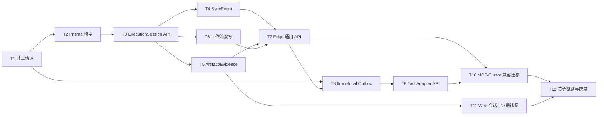

# FlowX 端云协同底座实施计划

> **执行要求：** 按任务依赖顺序实施；涉及 `prisma/schema.prisma`、`apps/api/src/workflow`、认证、API 边界和前端数据加载时，必须先补测试再改实现。
>
> **目标架构：** `docs/architecture/edge-cloud-ai-rd-platform.md`
>
> **计划范围：** 目标架构第一阶段“统一端云底座”，并为第二阶段多工具协同和第三阶段测试质量中心建立可扩展边界。

## 1. 目标

在不破坏现有 Cursor Extension、`flowx-local`、MCP 和 `claim-local/complete-local` 链路的前提下，建立第一版通用端云协同底座：

1. 共享且版本化的端云协议。
2. 独立于 `StageExecution` 的 `ExecutionSession`。
3. 幂等的 `SyncEvent` 和状态回传。
4. 统一 `Artifact/Evidence` 元数据中心。
5. `flowx-local` 端侧 Outbox、重试和 Tool Adapter SPI。
6. Cursor 旧链路兼容迁移到通用 Edge API。
7. Web 可以查看执行会话、事件和证据。

完成后应支持：

```text
FlowX 创建任务
  -> Cursor/Codex 认领
  -> 创建 ExecutionSession
  -> 端侧持续回传进度事件
  -> 本地开发、测试、Commit、Push
  -> 上传 Artifact/Evidence 元数据
  -> 幂等完成 ExecutionSession
  -> 复用现有工作流进入 Review / Human Review
```

## 2. 实施边界

### 2.1 本阶段包含

- 本地开发任务和 Bug 修复任务。
- `LOCAL`、`CLOUD`、`CI` 三类执行来源的模型预留，首期完整打通 `LOCAL`。
- Cursor、Codex 两种端侧启动 Adapter。
- Git 报告、测试摘要、设计/执行报告等 Artifact/Evidence 元数据。
- 本地文件 Artifact Provider，保留后续 MinIO/S3 Provider 接口。
- 端侧离线 Outbox、重试和幂等。
- 当前 SQLite 环境下可运行的 Prisma migration。
- 现有接口兼容和灰度开关。

### 2.2 本阶段不包含

- PostgreSQL 正式迁移。
- Redis/BullMQ 和多实例 Worker。
- MinIO/S3 预签名上传。
- 完整设备农场、浏览器集群和移动端自动化测试。
- 完整 Test Plan/Test Case/Test Run 产品能力。
- 六大中心的导航和页面空壳重构。
- 自动替用户执行 Git Push 或破坏性 Git 命令。
- 立即删除 `cursor-local` 或旧工作流 Artifact 文件结构。

## 3. 核心决策

### 3.1 状态职责

| 对象 | 职责 |
| --- | --- |
| `WorkflowRun` | 一次需求或 Bug 的业务流程 |
| `StageExecution` | 工作流中某阶段的一次 attempt |
| `ExecutionSession` | 某个 Agent、Adapter、Worker 或 CI 节点的真实执行会话 |
| `SyncEvent` | 会话中的追加式事件和进度记录 |
| `Artifact` | 可下载或可引用的产物元数据 |
| `Evidence` | 支撑完成、审查、测试和质量判断的证据 |

`ExecutionSession` 不能替代工作流状态机；工作流也不能继续用 `StageExecution.input/output` 承载所有端侧会话状态。

### 3.2 共享协议包

新增私有 workspace package：

```text
packages/flowx-protocol
├── src/version.ts
├── src/execution-session.ts
├── src/sync-event.ts
├── src/artifact.ts
├── src/context-package.ts
├── src/errors.ts
├── src/index.ts
└── src/*.test.ts
```

第一阶段不在 API 中引入第二套完整验证框架：

- `flowx-protocol` 提供 TypeScript 类型、枚举、版本常量、事件名和纯函数校验。
- NestJS API 继续通过 DTO 和 `class-validator` 做 HTTP 运行时校验。
- Contract spec 校验 DTO、协议类型和示例 Payload 的一致性。

### 3.3 兼容策略

- 旧 `/cursor-local/*` API 保留，内部委托给新的 Edge Service。
- 旧 `/workflow-runs/:id/execution/claim-local` 和 `complete-local` 保留。
- 新响应只追加可选字段，不删除旧字段。
- `claim-local` 创建 `ExecutionSession`，`complete-local` 完成同一会话。
- 第一阶段对旧工作流 Artifact 只做注册和关联，不批量搬迁历史文件。
- 所有新能力由 Feature Flag 控制，关闭时现有行为不变。

建议开关：

```env
FLOWX_EXECUTION_SESSION_WRITE_ENABLED=true
FLOWX_EDGE_SYNC_ENABLED=true
FLOWX_ARTIFACT_REGISTRY_ENABLED=true
```

## 4. 数据模型草案

字段可以在实现阶段小幅调整，但对象边界和关系不得省略。

### 4.1 ExecutionSession

```text
ExecutionSession
- id
- workflowRunId
- stageExecutionId?
- organizationId?
- workspaceId?
- projectId?
- deviceId?
- status: CREATED | CLAIMED | RUNNING | COMPLETING | COMPLETED | FAILED | CANCELLED
- executorType: LOCAL | CLOUD | CI
- sourceTool: cursor | codex | opendesign | shell | test-runner | flowx-worker
- protocolVersion
- traceId
- idempotencyKey?
- claimedByUserId?
- startedAt?
- lastHeartbeatAt?
- completedAt?
- errorCode?
- errorMessage?
- summary?
- metadata Json?
- createdAt
- updatedAt
```

约束：

- `traceId` 唯一。
- 同一个 `StageExecution` 最多一个未结束的主执行会话。
- 完成、失败、取消是终态，不能再次回到 `RUNNING`。
- `complete` 必须幂等，重复请求返回第一次完成结果。

### 4.2 SyncEvent

```text
SyncEvent
- id
- eventId unique
- executionSessionId
- schemaVersion
- sequence?
- eventType
- sourceTool
- actorId?
- deviceId?
- occurredAt
- receivedAt
- idempotencyKey unique
- payload Json
```

第一版事件：

- `execution.claimed`
- `execution.started`
- `execution.progressed`
- `execution.heartbeat`
- `execution.blocked`
- `artifact.reported`
- `evidence.reported`
- `execution.completion_requested`
- `execution.completed`
- `execution.failed`
- `execution.cancelled`

### 4.3 Artifact

```text
Artifact
- id
- workspaceId
- projectId?
- workflowRunId?
- executionSessionId?
- artifactType
- name
- version
- storageProvider: local | minio | s3 | external
- storageKey?
- externalUrl?
- mimeType?
- byteSize?
- sha256?
- status: PENDING | AVAILABLE | FAILED | DELETED
- metadata Json?
- createdByUserId?
- createdAt
- updatedAt
```

首期 `artifactType`：

- `DESIGN_HTML`
- `PLAN_HTML`
- `EXECUTION_REPORT`
- `DIFF_SUMMARY`
- `TEST_REPORT`
- `SCREENSHOT`
- `VIDEO`
- `LOG`
- `COVERAGE`
- `GIT_REFERENCE`

### 4.4 Evidence

```text
Evidence
- id
- executionSessionId
- artifactId?
- evidenceType
- sourceTool
- title
- summary?
- status: REPORTED | VERIFIED | REJECTED
- occurredAt
- metadata Json?
- createdAt
- updatedAt
```

首期 `evidenceType`：

- `GIT_COMMIT`
- `REMOTE_BRANCH_VERIFICATION`
- `CHANGED_FILES`
- `TEST_RESULT`
- `BUILD_RESULT`
- `USER_CONFIRMATION`
- `AGENT_SUMMARY`

## 5. API 草案

### 5.1 通用 Edge API

| Method | Path | 用途 |
| --- | --- | --- |
| `GET` | `/edge/tasks` | 查询当前用户可认领任务 |
| `GET` | `/edge/tasks/:type/:id/context` | 获取版本化上下文包 |
| `POST` | `/edge/handoffs` | 创建或继续本地执行会话 |
| `GET` | `/execution-sessions/:id` | 查询会话状态 |
| `POST` | `/execution-sessions/:id/events` | 幂等追加事件 |
| `POST` | `/execution-sessions/:id/artifacts` | 注册 Artifact 元数据 |
| `POST` | `/execution-sessions/:id/evidence` | 注册 Evidence |
| `POST` | `/execution-sessions/:id/complete` | 完成会话并推进工作流 |
| `POST` | `/execution-sessions/:id/cancel` | 取消会话 |

### 5.2 兼容 API

| 现有 API | 兼容实现 |
| --- | --- |
| `GET /cursor-local/tasks` | 委托 `EdgeTasksService.listTasks` |
| `GET /cursor-local/tasks/:type/:id/context` | 委托 `ContextPackageService` |
| `POST /cursor-local/handoff` | 委托 `EdgeHandoffService` |
| `POST /workflow-runs/:id/execution/claim-local` | 创建/返回 `ExecutionSession` |
| `POST /workflow-runs/:id/execution/complete-local` | 转换为会话完成命令 |
| `POST /workflow-runs/:id/execution/cancel-local` | 取消活动会话并恢复工作流 |

### 5.3 错误码

第一阶段至少稳定以下错误码，客户端不能只解析自然语言：

- `EDGE_TASK_NOT_ELIGIBLE`
- `EDGE_REPOSITORY_MISMATCH`
- `EXECUTION_SESSION_CONFLICT`
- `EXECUTION_SESSION_TERMINAL`
- `SYNC_EVENT_DUPLICATE`
- `SYNC_EVENT_OUT_OF_ORDER`
- `ARTIFACT_INVALID_REFERENCE`
- `REMOTE_BRANCH_NOT_VERIFIED`
- `PROTOCOL_VERSION_UNSUPPORTED`

## 6. 任务依赖



## 7. 实施任务

### Task 1：建立 `flowx-protocol` 共享协议包

**目标：** 先固定协议语言，避免 API、MCP、Local 和 Extension 各自定义 Payload。

**文件：**

- Create: `packages/flowx-protocol/package.json`
- Create: `packages/flowx-protocol/tsconfig.json`
- Create: `packages/flowx-protocol/src/version.ts`
- Create: `packages/flowx-protocol/src/execution-session.ts`
- Create: `packages/flowx-protocol/src/sync-event.ts`
- Create: `packages/flowx-protocol/src/artifact.ts`
- Create: `packages/flowx-protocol/src/context-package.ts`
- Create: `packages/flowx-protocol/src/errors.ts`
- Create: `packages/flowx-protocol/src/index.ts`
- Create: `packages/flowx-protocol/src/protocol.test.ts`
- Modify: `pnpm-lock.yaml`

**步骤：**

- [x] 定义 `FLOWX_PROTOCOL_VERSION = "1.0"`。
- [x] 定义执行状态、executor、source tool、事件名和错误码。
- [x] 定义 `FlowXSyncEvent<T>`、`ContextPackage`、`CompletionReport`。
- [x] 增加版本兼容函数和事件必填字段校验。
- [x] 提供可复用的幂等键生成规则，不在客户端随机拼字符串。
- [x] 测试未知版本、缺失 ID、非法终态流转和重复事件示例。

**验收：**

- API、MCP、Local、Cursor Extension 均可依赖该 package。
- 协议包不依赖 NestJS、React 或 Node 文件系统。
- `pnpm --filter flowx-protocol test` 通过。

### Task 2：新增 Prisma 基础模型和 migration

**目标：** 建立可追踪、可查询、可幂等的持久化边界。

**文件：**

- Modify: `prisma/schema.prisma`
- Create: `prisma/migrations/<timestamp>_add_edge_execution_foundation/migration.sql`
- Create: `apps/api/src/execution-sessions/execution-session.repository.spec.ts`

**步骤：**

- [x] 新增 `ExecutionSession`、`SyncEvent`、`Artifact`、`Evidence`。
- [x] 补齐 `WorkflowRun`、`StageExecution`、`Workspace`、`Project`、`User` 的关系。
- [x] 为 `traceId`、`eventId`、`idempotencyKey`、`workflowRunId/status` 建索引或唯一约束。
- [x] 明确 SQLite 可执行的默认值和 migration 顺序。
- [x] 为历史数据保留所有可空关系，不进行破坏性 backfill。
- [x] 运行 Prisma generate 和 migration 测试。

**验收：**

- 现有数据库可无损迁移。
- 旧工作流查询和测试不需要 backfill 才能工作。
- `pnpm prisma:generate`、API build/test 通过。

### Task 3：实现 Execution Sessions 模块

**目标：** 用独立服务管理真实执行生命周期。

**文件：**

- Create: `apps/api/src/execution-sessions/execution-sessions.module.ts`
- Create: `apps/api/src/execution-sessions/execution-sessions.controller.ts`
- Create: `apps/api/src/execution-sessions/execution-sessions.service.ts`
- Create: `apps/api/src/execution-sessions/execution-session-state.ts`
- Create: `apps/api/src/execution-sessions/dto/*.ts`
- Create: `apps/api/src/execution-sessions/execution-sessions.service.spec.ts`
- Modify: `apps/api/src/app.module.ts`

**步骤：**

- [x] 先写状态机测试：创建、认领、运行、完成、失败、取消。
- [x] 实现 `createOrReuseSession`，同一幂等键返回同一会话。
- [x] 实现活动会话冲突检测。
- [x] 实现心跳和 `lastHeartbeatAt`。
- [x] 实现终态保护和重复完成返回。
- [x] 所有查询按现有组织/工作区权限过滤。
- [x] Controller 只处理 DTO 和响应映射，状态逻辑留在 Service。

**验收：**

- 同一个完成请求发送两次不会重复推进工作流。
- 用户不能读取其他组织的执行会话。
- 状态转换测试完整覆盖。

### Task 4：实现 SyncEvent 追加与幂等

**目标：** 建立端侧进度、心跳和阻塞信息的统一回传入口。

**文件：**

- Create: `apps/api/src/execution-sessions/sync-events.service.ts`
- Create: `apps/api/src/execution-sessions/sync-events.service.spec.ts`
- Modify: `apps/api/src/execution-sessions/execution-sessions.controller.ts`
- Modify: `apps/api/src/execution-sessions/execution-sessions.module.ts`

**步骤：**

- [x] 先写重复 `eventId/idempotencyKey` 测试。
- [x] 校验协议版本、会话归属、事件类型和终态限制。
- [x] 同一重复事件返回原事件，不重复写入。
- [x] `execution.heartbeat` 更新会话心跳但保留事件历史。
- [x] `execution.blocked` 只记录阻塞，不直接把工作流置为失败。
- [x] 为事件列表提供稳定分页和时间排序。

**验收：**

- 网络重试不会生成重复事件。
- 事件可以按 ExecutionSession 和 traceId 查询。
- 不允许给已取消会话追加普通进度事件。

### Task 5：建立 Artifact/Evidence Center 最小实现

**目标：** 统一登记设计、执行、测试和 Git 证据，同时兼容现有文件 Artifact。

**文件：**

- Create: `apps/api/src/artifacts/artifacts.module.ts`
- Create: `apps/api/src/artifacts/artifacts.controller.ts`
- Create: `apps/api/src/artifacts/artifacts.service.ts`
- Create: `apps/api/src/artifacts/artifact-storage.provider.ts`
- Create: `apps/api/src/artifacts/local-artifact-storage.provider.ts`
- Create: `apps/api/src/artifacts/evidence.service.ts`
- Create: `apps/api/src/artifacts/dto/*.ts`
- Create: `apps/api/src/artifacts/*.spec.ts`
- Modify: `apps/api/src/app.module.ts`
- Modify: `apps/api/src/workflow/workflow-artifact.service.ts`

**步骤：**

- [x] 先测试路径穿越、重复 sha256、无效外部 URL 和越权读取。
- [x] 定义 `ArtifactStorageProvider`，首期实现本地文件 Provider。
- [x] 将本地文件写入和元数据登记分开。
- [x] 支持纯引用 Artifact，例如 Git Commit、MR URL。
- [x] 现有 plan/execution/design Artifact 写入成功后可选登记数据库记录。
- [x] Evidence 可以引用 Artifact，也可以只保存结构化 metadata。
- [x] 删除操作先标记 `DELETED`，不在主事务中物理删除大文件。

**验收：**

- 原有 HTML Artifact 预览不受影响。
- 新 Artifact 可以按 WorkflowRun、ExecutionSession、类型查询。
- Artifact 注册失败不能把已完成代码执行误标为失败；需记录可恢复错误。

### Task 6：将本地工作流双写到 ExecutionSession

**目标：** 保持现有工作流行为，同时把本地执行投影到新会话模型。

**文件：**

- Modify: `apps/api/src/workflow/workflow.service.ts`
- Modify: `apps/api/src/workflow/workflow.controller.ts`
- Modify: `apps/api/src/workflow/workflow.module.ts`
- Modify: `apps/api/src/workflow/dto/complete-local-execution.dto.ts`
- Modify: `apps/api/src/workflow/workflow-local-execution.spec.ts`
- Modify: `apps/api/src/workflow/workflow-local-handoff.spec.ts`

**步骤：**

- [x] 先为 `claim-local` 创建会话和 `complete-local` 幂等补测试。
- [x] `claimLocalExecution` 在同一事务中创建 `StageExecution` 和 `ExecutionSession`。
- [x] Handoff 响应追加 `executionSessionId`、`traceId`、`protocolVersion`。
- [x] `completeLocalExecution` 查找活动会话并转为统一 `CompletionReport`。
- [x] 远程分支验证结果写为 Evidence。
- [x] Git Commit、changed files、test result 和用户摘要写为 Evidence/Artifact。
- [x] 完成会话后调用现有 `finalizeExecutionSuccess`，不复制工作流流转逻辑。
- [x] `cancel-local` 同步取消会话，再恢复 `EXECUTION_PENDING`。
- [x] Feature Flag 关闭时保持旧实现路径。

**验收：**

- 现有 Web、Cursor Extension、MCP 不升级也能完成任务。
- 本地和云端执行最终仍进入相同 Review 路径。
- 重复完成请求不重复创建 `CodeExecution`、Artifact 或通知。

### Task 7：抽取通用 Edge Tasks / Handoff API

**目标：** 将 Cursor 专用业务逻辑迁移到工具无关的服务层。

**文件：**

- Create: `apps/api/src/edge/edge.module.ts`
- Create: `apps/api/src/edge/edge.controller.ts`
- Create: `apps/api/src/edge/edge-tasks.service.ts`
- Create: `apps/api/src/edge/edge-handoff.service.ts`
- Create: `apps/api/src/edge/context-package.service.ts`
- Create: `apps/api/src/edge/dto/*.ts`
- Create: `apps/api/src/edge/*.spec.ts`
- Modify: `apps/api/src/cursor-local/cursor-local.service.ts`
- Modify: `apps/api/src/cursor-local/cursor-local.controller.ts`
- Modify: `apps/api/src/app.module.ts`

**步骤：**

- [x] 先把现有 Cursor Local 测试转换为通用 Edge Service contract tests。
- [x] `EdgeTasksService` 统一 Requirement/Bug 的任务可认领规则。
- [x] `ContextPackageService` 输出带版本的上下文包。
- [x] `EdgeHandoffService` 负责创建/继续工作流和 ExecutionSession。
- [x] `CursorLocalService` 只保留兼容映射，不再复制业务判断。
- [x] 为 `sourceTool=cursor|codex` 生成不同启动提示，但共享任务上下文。

**验收：**

- `/edge/tasks` 与 `/cursor-local/tasks` 对同一用户返回等价任务集合。
- Cursor 和 Codex 可以从同一个任务创建同结构 Handoff。
- 业务规则只存在于通用 Edge Service。

### Task 8：为 `flowx-local` 增加设备身份和可靠 Outbox

**目标：** 端侧断网后可缓存事件和完成报告，恢复网络后安全重放。

**文件：**

- Modify: `packages/flowx-local/src/config.ts`
- Create: `packages/flowx-local/src/device.ts`
- Create: `packages/flowx-local/src/outbox.ts`
- Create: `packages/flowx-local/src/edge-client.ts`
- Create: `packages/flowx-local/src/device.test.ts`
- Create: `packages/flowx-local/src/outbox.test.ts`
- Create: `packages/flowx-local/src/edge-client.test.ts`
- Modify: `packages/flowx-local/src/server.ts`
- Modify: `packages/flowx-local/src/index.ts`
- Modify: `packages/flowx-local/package.json`

**步骤：**

- [x] 配置增加 `installationId`、`deviceId`、`apiBaseUrl` 和协议版本。
- [x] 不把短期 token 写入 Outbox Payload。
- [x] Outbox 使用 `~/.flowx/outbox/<eventId>.json`，临时文件写完后原子 rename。
- [x] 每项保存 attempt、nextRetryAt、lastError，不静默丢弃失败项。
- [x] 按指数退避重试，重复发送依赖服务端幂等。
- [x] 增加 `flowx-local status`、`flowx-local sync` 命令。
- [x] `/health` 返回 device、protocol、outbox pending 数量，不返回密钥。

**验收：**

- 模拟 API 离线时事件进入 Outbox。
- 重启 `flowx-local` 后待发送项仍存在。
- 网络恢复后重放成功并删除本地项。
- 重放两次不会导致服务端重复事件或重复完成。

### Task 9：建立 Tool Adapter SPI 与 Cursor/Codex Adapter

**目标：** 把 IDE 启动和任务交接从条件分支演进为 Adapter。

**文件：**

- Create: `packages/flowx-local/src/adapters/tool-adapter.ts`
- Create: `packages/flowx-local/src/adapters/adapter-registry.ts`
- Create: `packages/flowx-local/src/adapters/cursor-adapter.ts`
- Create: `packages/flowx-local/src/adapters/codex-adapter.ts`
- Create: `packages/flowx-local/src/adapters/*.test.ts`
- Modify: `packages/flowx-local/src/open-ide.ts`
- Modify: `packages/flowx-local/src/launch.ts`

**步骤：**

- [x] 定义 capability：`chat-handoff`、`repo-open`、`terminal`、`completion-report`。
- [x] Adapter Registry 按工具名解析实现并返回能力。
- [x] Cursor Adapter 复用现有 Cursor 打开和 prompt 交接行为。
- [x] Codex Adapter 复用现有 Codex 打开逻辑，补齐上下文文件和完成指引。
- [x] `launch.ts` 不再直接判断工具细节。
- [x] Adapter 不直接更新工作流，只调用 Edge Client/Outbox。

**验收：**

- 现有 Cursor 本地启动体验保持一致。
- Codex 与 Cursor 接收同版本 ContextPackage。
- 新 Adapter 可以不修改 `launch.ts` 核心流程直接注册。

#### Task 9A：OpenDesign 本地设计 Adapter（已完成的增量）

本次先按黄金链路实现 OpenDesign Adapter，Cursor/Codex Adapter Registry 仍按 Task 9 后续推进。

- [x] 定义 `OpenDesignContextPackage`、`OpenDesignHandoff` 和 `DesignCompletionReport`。
- [x] 创建 `LOCAL_DESIGN` WorkflowRun 和 `sourceTool=opendesign` 的 ExecutionSession。
- [x] 通过一次性 ticket 将短期凭据和版本化 ContextPackage 交给本机 `flowx-local`。
- [x] 生成 `context.json`、`result.json`、`README.md` 和权限为 `0600` 的 `session.json`。
- [x] 回传设计 Artifact、`AGENT_SUMMARY` Evidence 和幂等 CompletionReport。
- [x] API 离线时进入可靠 Outbox，并支持 `design-submit` / `sync` 重放。
- [x] Web 增加 `OpenDesign 设计`、`打开本地 OpenDesign` 和 `回传本地设计` 入口。

当前限制：设备级长期凭据与 token 自动刷新尚未实现；`openDesignCommand` 先支持单个可执行文件路径。

### Task 10：迁移 MCP 和 Cursor Extension 到通用协议

**目标：** 客户端使用通用 API，同时保留服务端旧接口兼容。

**文件：**

- Modify: `packages/flowx-mcp/package.json`
- Modify: `packages/flowx-mcp/src/flowx-api-client.ts`
- Modify: `packages/flowx-mcp/src/tools.ts`
- Modify: `packages/flowx-mcp/src/*.test.ts`
- Modify: `apps/cursor-extension/package.json`
- Modify: `apps/cursor-extension/src/flowx-client.ts`
- Modify: `apps/cursor-extension/src/handoff.ts`
- Modify: `apps/cursor-extension/src/local-execution.ts`
- Modify: `apps/cursor-extension/src/*.test.ts`

**步骤：**

- [x] 依赖 `flowx-protocol`，删除重复 Payload 类型。
- [x] MCP 新增 `flowx_report_progress`、`flowx_report_evidence`。
- [x] `flowx_report_completion` 优先调用 ExecutionSession API。
- [x] Cursor Extension 保存并传递 `executionSessionId`。
- [ ] API 不可用时保留本地完成草稿并支持重试。
- [ ] 旧服务器不支持新 API 时给出明确版本错误，不静默降级完成。

**验收：**

- Cursor Extension 全部现有测试通过。
- MCP Git Report 和完成上报测试通过。
- 新旧 API 兼容矩阵有自动化测试。

### Task 11：Web 增加执行会话与证据视图

**目标：** 让项目成员能在 FlowX Web 查看端侧执行过程，而不是只看到最终 Stage output。

**文件：**

- Modify: `apps/web/src/types.ts`
- Modify: `apps/web/src/api.ts`
- Create: `apps/web/src/components/ExecutionSessionPanel.tsx`
- Create: `apps/web/src/components/ExecutionSessionPanel.test.tsx`
- Create: `apps/web/src/components/EvidenceList.tsx`
- Create: `apps/web/src/components/EvidenceList.test.tsx`
- Modify: `apps/web/src/pages/WorkflowRunDetailPage.tsx`
- Modify: `apps/web/src/pages/WorkflowRunDetailPage.test.tsx`

**步骤：**

- [ ] 先写会话状态、离线、阻塞、完成和重复上报 UI 测试。
- [x] 工作流详情 Execution 阶段展示当前会话、工具、设备、心跳和 traceId。
- [x] 展示 Git、测试、Artifact 和远程验证 Evidence。
- [x] 保留现有本地 Handoff 和完成对话框。
- [x] 未启用新后端能力时隐藏会话面板，不报错。
- [x] 不在前端轮询高频事件；首期使用低频刷新，后续再接 SSE/WebSocket。

**验收：**

- 不支持新字段的旧 Workflow 响应仍可渲染。
- 用户可以从工作流详情定位本次执行的 Commit、测试和证据。
- `apps/web/src/api.ts` 边界有完整测试。

### Task 12：黄金链路、恢复测试和灰度上线

**目标：** 验证端云底座在真实断网、重试和重复请求场景下可靠工作。

**文件：**

- Create: `apps/api/src/edge/edge-golden-path.spec.ts`
- Create: `docs/edge-agent-operations.md`
- Modify: `docs/user-manual.md`
- Modify: `README.md`
- Modify: `docs/architecture/edge-cloud-ai-rd-platform.md`
- Modify: `docs/docker-deployment.md`（仅新增环境变量时）

**测试场景：**

- [x] Requirement 从 Cursor 认领并完成。
- [ ] Bug 从 Codex 认领并完成。
- [ ] API 离线后进度事件和完成报告进入 Outbox。
- [ ] 网络恢复后事件按幂等规则重放。
- [x] 完成请求在响应丢失后再次发送。
- [x] Push 未完成时远程验证失败，会话保持可恢复。
- [x] 用户取消后旧完成请求不能推进工作流。
- [ ] Artifact 文件写入成功但数据库登记失败时可恢复。
- [ ] 数据库登记成功但客户端未收到响应时重复请求返回原结果。
- [x] 旧 Cursor Extension 仍能通过兼容 API 完成任务。

**灰度顺序：**

1. 开启协议读取和新表写入，但 UI 不展示。
2. 开启 `claim-local/complete-local` 双写。
3. 开启新 Edge API 和新版 MCP。
4. 开启新版 Cursor Extension 和 Web 会话面板。
5. 观察至少一周后，再考虑将通用 API 设为默认。

**验收：**

- `pnpm check` 全部通过。
- 黄金链路可重复执行，无手工数据库修复。
- Feature Flag 关闭后现有链路仍工作。
- 文档说明回滚步骤、Outbox 诊断和常见错误码。

## 8. PR 与提交拆分

避免把 Prisma、工作流、Local、MCP、Extension 和 Web 放进一个不可审查的大提交。

### PR 1：协议与数据模型

包含：Task 1～2。

建议提交：

```text
feat(protocol): 建立端云执行共享协议
feat(api): 新增 ExecutionSession 与同步基础模型
```

合并门槛：

- Prisma migration 可在空库和现有开发库执行。
- 不改变现有 API 行为。
- 协议包测试、API build/test 通过。

### PR 2：API 执行会话与工作流双写

包含：Task 3～7。

建议提交：

```text
feat(api): 增加执行会话与同步事件模块
feat(api): 建立 Artifact 与 Evidence 注册中心
refactor(api): 本地执行双写 ExecutionSession
refactor(api): 抽取通用 Edge 任务与交接服务
```

合并门槛：

- 现有工作流测试全部通过。
- 旧 Cursor Local API contract 不变。
- 重复完成、取消后完成、跨组织访问均有测试。

### PR 3：Edge Agent 与 Adapter

包含：Task 8～9。

建议提交：

```text
feat(local): 增加端侧 Outbox 与可靠重试
refactor(local): 建立 Tool Adapter SPI
```

合并门槛：

- 离线、重启、重试和重复发送测试通过。
- Cursor/Codex 启动行为不回退。
- Outbox 不保存明文短期 token。

### PR 4：MCP 与 Cursor Extension 迁移

包含：Task 10。

建议提交：

```text
feat(mcp): 支持执行进度与证据上报
refactor(cursor): 迁移到通用 Edge 执行协议
```

合并门槛：

- MCP、Cursor Extension 全部测试通过。
- 新客户端对旧服务端给出明确兼容提示。
- 完成草稿可重试且不会丢失。

### PR 5：Web、黄金链路与灰度

包含：Task 11～12。

建议提交：

```text
feat(web): 展示执行会话与证据
test(edge): 覆盖端云协同黄金链路
docs: 增加 Edge Agent 运维与灰度说明
```

合并门槛：

- `pnpm check` 通过。
- Feature Flag 开关路径均验证。
- 手工完成一次 Cursor 和一次 Codex 黄金链路。

## 9. 四周迭代安排

以 1～2 名全职开发为基准；若只有 1 名开发，建议按 5～6 周执行，不压缩验证时间。

| 时间 | 主要交付 | 对应任务 |
| --- | --- | --- |
| 第 1 周 | 协议、Prisma、ExecutionSession 状态机 | Task 1～3 |
| 第 2 周 | SyncEvent、Artifact/Evidence、工作流双写 | Task 4～6 |
| 第 3 周 | 通用 Edge API、flowx-local Outbox、Adapter | Task 7～9 |
| 第 4 周 | MCP/Cursor/Web、黄金链路、灰度文档 | Task 10～12 |

每天的开发顺序：

1. 添加或更新最近的自动化测试。
2. 实现最小业务改动。
3. 运行目标 package/module 测试。
4. 检查 API 和协议兼容性。
5. 每个 PR 合并前运行 `pnpm check`。

## 10. 风险与对策

| 风险 | 影响 | 对策 |
| --- | --- | --- |
| `workflow.service.ts` 继续膨胀 | 新会话逻辑难维护 | 状态和同步逻辑放独立模块，Workflow 只编排 |
| Stage 与 Session 双状态不一致 | 工作流卡死或重复完成 | 同一事务写关键状态，终态幂等，增加一致性测试 |
| SQLite 并发写限制 | 高频心跳阻塞业务写入 | 心跳限频；首期低频事件；为 PostgreSQL 迁移保留边界 |
| Artifact 文件与数据库不一致 | 证据丢失或孤儿文件 | 两阶段状态 `PENDING/AVAILABLE`，增加恢复任务 |
| Outbox 保存敏感信息 | 本地凭据泄漏 | Payload 不保存 token；文件权限收紧；短期凭据按发送时获取 |
| 旧 Cursor 客户端被破坏 | 本地开发中断 | 兼容 Controller、追加字段、Feature Flag、兼容 contract tests |
| 重试触发重复通知或 Bug | 数据污染 | 全链路 idempotencyKey，完成和转换操作唯一约束 |
| 六大中心同时开工 | 交付周期失控 | 第一阶段只做 Edge/Sync/Execution/Artifact 底座 |

## 11. Definition of Done

第一阶段只有满足以下条件才算完成：

- [ ] `flowx-protocol` 成为 API、MCP、Local、Cursor Extension 的共享协议来源。
- [ ] 每次本地执行都有独立 `ExecutionSession` 和稳定 `traceId`。
- [ ] 进度、心跳、阻塞、完成事件可追溯且幂等。
- [ ] Git、测试和用户确认可以作为 Evidence 查询。
- [ ] 现有设计、方案和执行 Artifact 可以登记到统一 Artifact Center。
- [ ] `flowx-local` 支持离线 Outbox、重启恢复和手工 `sync`。
- [ ] Cursor 和 Codex 使用相同的 ContextPackage 和完成协议。
- [ ] Web 能查看会话、事件和 Evidence。
- [ ] 旧 Cursor Extension 和旧 API 仍可用。
- [ ] Feature Flag 可关闭新路径并回退旧逻辑。
- [ ] `pnpm check` 通过，新增关键边界均有自动化测试。

## 12. 第二、三阶段待办入口

第一阶段完成后再启动以下 Epic：

### 第二阶段：多工具与数字主线

- `OpenDesignAdapter` 与设计 Artifact 同步。
- 版本化 `ContextPackage`、`PromptVersion`、`SkillVersion`。
- Project Digital Thread 查询 API 和项目详情视图。
- MinIO/S3 Provider 与预签名上传。
- Execution Worker 和异步队列边界。

### 第三阶段：测试与质量中心

- `TestPlan`、`TestCase`、`TestSuite`、`TestRun`、`TestResult`。
- JUnit/Vitest/Jest/Playwright 结果解析器。
- Local/CI/Cloud Test Runner。
- Finding 聚合、Bug 转换、回归关联。
- Quality Gate 和发布门禁。
- 质量趋势、覆盖率和研发效能指标。

第二、三阶段分别编写独立设计规范和实施计划，不在第一阶段提前创建空模型或空页面。
