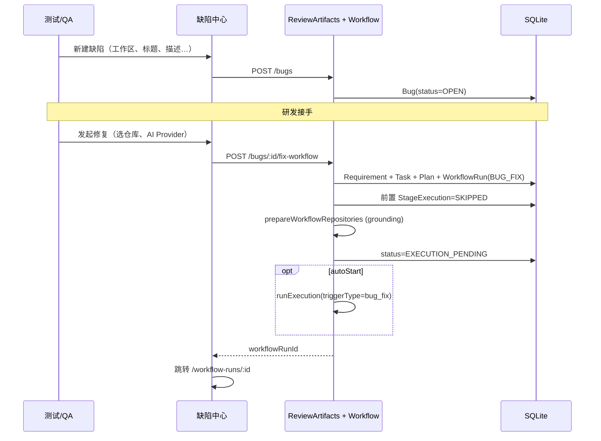

# 手动缺陷登记与缺陷修复工作流 — 设计规格

**日期：** 2026-05-18  
**状态：** 待评审  
**范围：** 缺陷手动创建、从缺陷一键发起「仅执行 + 审查」的修复工作流

---

## 1. 背景与目标

### 1.1 现状

- **缺陷（Bug）** 已有完整数据模型（`prisma/schema.prisma` → `Bug`），支持工作区、来源需求/工作流、审查条目转换等。
- **缺陷中心 UI**（`BugsPage` / `BugDetailPage`）仅支持列表、筛选、编辑；**不能手动新建**。
- **创建缺陷** 目前唯一路径：`ReviewFinding` → `POST /review-findings/:id/convert-to-bug`（`review-artifacts.service.ts`）。
- **工作流** 必须从 `Requirement` 发起，经仓库 grounding → ideation → 任务拆解 → 技术方案 → **执行** → **AI 审查** → **人工审查**。
- `Bug.fixRequirementId` 已存在，**尚未使用**；用于关联「修复专用需求」的意图已预留。
- 已有 **`review_finding_fix`** 执行触发器：在同一工作流内基于审查结果重新执行，**不能**从独立缺陷冷启动。

### 1.2 用户目标

| 角色 | 目标 |
|------|------|
| 测试 / QA | 在工作区下**手动登记缺陷**（标题、描述、严重级别、复现步骤等），无需先走完整研发流程 |
| 研发 | 在缺陷详情中**选择工作区与仓库**，根据缺陷描述**一键发起修复工作流** |
| 流程约束 | 用户理解的工作流只需 **研发执行 + 审查**；头脑风暴、设计、Demo、任务拆解、技术方案等**全部跳过** |

### 1.3 成功标准

1. QA 可在 UI 创建缺陷，缺陷出现在缺陷中心且状态为 `OPEN`。
2. 研发可对 `OPEN` / `CONFIRMED` 缺陷发起修复；系统创建关联的修复需求与工作流。
3. 修复工作流创建后处于 **`EXECUTION_PENDING`**（或用户选择后立即进入执行），阶段时间线上前置阶段标记为 **`SKIPPED`**。
4. 执行完成后走现有 **AI 审查 → 人工审查** 路径；缺陷状态随流程推进（`FIXING` → `FIXED` / `VERIFIED`）。
5. 不破坏现有「需求 → 全量工作流」路径；变更集中在状态机允许的窄入口。

---

## 2. 非目标（YAGNI）

- 不做完整 **Project / runType 并行体系**（见 `docs/multi-project-parallel-analysis.md`）——仅引入最小 `runType` 字段区分修复流。
- 不做缺陷分配、SLA、通知模板大改。
- 不做「一个缺陷多个并行修复工作流」；**一期一个缺陷最多一个活跃修复工作流**。
- 不自动从缺陷创建 Issue；缺陷与 Issue 继续分轨。

---

## 3. 关键设计决策

### 3.1 「跳过前面阶段」的精确含义

| 阶段 | 处理 | 说明 |
|------|------|------|
| Repository grounding | **保留（自动）** | AI 执行需要仓库本地副本与 context；对用户不可见，不增加确认步骤 |
| Brainstorm / Design / Demo | **SKIPPED** | 无 ideation 产物 |
| Task split | **SKIPPED** | 用缺陷信息合成 **1 条 Task** |
| Technical plan | **SKIPPED** | 用缺陷信息合成 **已确认 Plan** |
| Execution | **正常** | 复用 `runExecution`，`triggerType: bug_fix` |
| AI review + Human review | **正常** | 与主线一致 |

用户看到的有效阶段：**研发执行 → AI 审查 → 人工审查**（与「后面两个阶段」一致，审查拆成 AI + 人工两步为现有产品行为）。

### 3.2 为何仍创建 Requirement

`WorkflowRun` 强绑定 `requirementId`；执行器输入依赖 `requirement.title/description/acceptanceCriteria`。  
修复流创建 **专用 Requirement**（`Bug.fixRequirementId`），内容由缺陷字段组装，不污染原始功能需求。

### 3.3 runType 与关联字段

在 `WorkflowRun` 增加：

```prisma
runType  String  @default("FULL")  // FULL | BUG_FIX
bugId    String?
bug      Bug?    @relation(...)
```

在 `Bug` 增加（与 `workflowRunId`「来源流」区分）：

```prisma
fixWorkflowRunId  String?  @unique
fixWorkflowRun    WorkflowRun?  @relation("BugFixWorkflow", ...)
```

`workflowRunId` 继续表示「缺陷从哪次审查产生」；`fixWorkflowRunId` 表示「当前/最近一次修复流」。

### 3.4 项目（Project）选择策略

创建缺陷时：**必选工作区**；**可选项目**（下拉，默认工作区内第一个 ACTIVE 项目，若无则自动创建内置项目 `缺陷修复`）。

发起修复时：使用缺陷登记时的 `projectId`（若已存）或同上默认策略，用于创建 `Requirement.projectId`。

---

## 4. 数据流



---

## 5. API 设计

### 5.1 手动创建缺陷

`POST /bugs`

```typescript
{
  workspaceId: string;      // required
  projectId?: string;         // optional, must belong to workspace
  title: string;
  description: string;
  severity?: 'LOW'|'MEDIUM'|'HIGH'|'CRITICAL';
  priority?: 'LOW'|'MEDIUM'|'HIGH'|'URGENT';
  expectedBehavior?: string;
  actualBehavior?: string;
  reproductionSteps?: string[];
  repositoryId?: string;    // optional default repo hint
  branchName?: string;
}
```

响应：完整 `Bug`（含 workspace、project 若扩展）。

权限：与现有 review-artifacts 路由一致（已登录会话）。

### 5.2 发起缺陷修复工作流

`POST /bugs/:id/fix-workflow`

```typescript
{
  repositoryIds?: string[];  // default: workspace all ACTIVE repos or bug.repositoryId
  aiProvider?: 'codex' | 'cursor';
  autoStart?: boolean;       // default true — 创建后立即 runExecution
}
```

前置校验：

- Bug `status` ∈ `OPEN`, `CONFIRMED`
- 无活跃 `fixWorkflowRun`（`status` ∉ `DONE`, `FAILED`）
- 工作区至少一个 ACTIVE 仓库（若指定 `repositoryIds` 则校验归属）

副作用：

1. 创建/复用 fix Requirement，写入 `fixRequirementId`
2. Bug `status` → `FIXING`
3. 创建 `WorkflowRun(runType=BUG_FIX, bugId)`
4. Bootstrap：SKIPPED 阶段 + 合成 Task/Plan + `EXECUTION_PENDING`
5. `fixWorkflowRunId` 指向新 run
6. 若 `autoStart`（默认 true）→ `runExecution(..., { triggerType: 'bug_fix', findingTitle: bug.title })`

响应：

```typescript
{
  bug: Bug;
  requirement: { id: string; title: string };
  workflowRun: WorkflowRun;  // 与 findOne 结构一致
}
```

### 5.3 查询增强

- `GET /bugs/:id` include `fixWorkflowRun`, `fixRequirement`
- `GET /workflow-runs?runType=BUG_FIX`（可选，一期可在列表 UI 用 badge 区分）

---

## 6. 工作流 Bootstrap 实现要点

新增 `WorkflowService.createBugFixWorkflowRun(bugId, dto)`（或 `BugFixWorkflowService` 若需控制 `workflow.service.ts` 体积）：

1. **事务内**创建 `WorkflowRun` + `WorkflowRepository` 记录（复用 `createWorkflowRun` 中仓库选择与分支命名逻辑，抽取私有方法 `attachRepositoriesToWorkflow`）。
2. **不**调用 `transitionWorkflow` 走完整 CREATED → grounding 状态链；改为：
   - 调用 `prepareWorkflowRepositories`（与现网一致）
   - 批量 `createStageExecution` + `updateStageExecution(SKIPPED)` for: `REPOSITORY_GROUNDING`, `BRAINSTORM`, `DESIGN`, `DEMO`, `TASK_SPLIT`, `TECHNICAL_PLAN`
   - Grounding 的 stage 可记为 `COMPLETED`（若 grounding 同步完成）或 `SKIPPED` 且 output 注明 `source: bug_fix_bootstrap` — **推荐 COMPLETED + 简短 output**，便于工作流详情页展示「仓库已就绪」
3. 插入 **1× Task**（`CONFIRMED`）：title = bug.title，description = 组装后的修复说明（含复现步骤、预期/实际行为）
4. 插入 **Plan**（`CONFIRMED`）：content 为 Markdown/JSON 结构，sections 来自缺陷描述 + 验收标准（`expectedBehavior` 或「修复后不再复现」）
5. `transitionWorkflow` 直接到 **`EXECUTION_PENDING`**（在 state machine 中为 BUG_FIX 增加 **bootstrap 白名单** 或专用 `forceTransitionForBugFix` 方法，**禁止** FULL 流滥用）

`runExecution` 扩展：

- `triggerType === 'bug_fix'` 时 completion 目标与 `review_finding_fix` 相同 → `HUMAN_REVIEW_PENDING`（执行后进入审查，而非停在 `REVIEW_PENDING` 需再点）— **与 review_finding_fix 对齐**，减少多余点击
- 执行 prompt 上下文增加 `bugId` / 缺陷摘要（可选，一期用 humanFeedback 注入即可）

状态机（`workflow-state-machine.ts`）：

- 新增 `canBootstrapBugFixToExecution(): boolean` 或在 service 层校验 `runType === BUG_FIX` 时允许 `PLAN_CONFIRMED → EXECUTION_PENDING` 的「虚拟」前置状态
- 单元测试覆盖非法 FULL 流不能直接 bootstrap

---

## 7. 前端设计

### 7.1 缺陷列表 `BugsPage`

- **PageHeader 主 CTA**：「新建缺陷」
- **Dialog / Sheet** 表单：工作区、项目（级联）、标题、描述、严重级别、优先级、复现步骤（多行）、预期/实际行为、可选仓库
- 提交调用 `api.createBug`

### 7.2 缺陷详情 `BugDetailPage`

- **主 CTA**（`OPEN`/`CONFIRMED` 且无可活跃 fix run）：「发起修复工作流」
- **Dialog**：仓库多选（默认工作区仓库）、AI Provider、是否立即开始执行（默认开）
- 成功后 toast + 跳转 `WorkflowRunDetailPage`
- 若已有 `fixWorkflowRun`：展示状态 badge + 「查看修复工作流」链接
- ContextPanel 增加「修复工作流」区块（与「来源流程」并列）

### 7.3 工作流详情 `WorkflowRunDetailPage`

- `runType === BUG_FIX` 时：
  - 顶部 badge「缺陷修复」
  - 链接回关联缺陷
  - 阶段卡片：已跳过阶段折叠/灰色，突出执行与审查

### 7.4 API 客户端 `api.ts`

- `createBug`
- `startBugFixWorkflow(bugId, payload)`

类型：`Bug.fixWorkflowRun`, `Bug.projectId`, `WorkflowRun.runType`, `WorkflowRun.bugId`

---

## 8. 缺陷状态机

| 事件 | Bug.status |
|------|------------|
| 手动创建 | `OPEN` |
| 发起修复 | `FIXING` |
| 修复工作流 DONE + 人工 ACCEPT | `FIXED`（可手动改 `VERIFIED`） |
| 修复工作流 FAILED | 回 `CONFIRMED` 或保持 `FIXING` 并展示失败（**推荐回 `CONFIRMED`** 允许重试） |
| 人工 REWORK | 保持 `FIXING`，可再次触发执行（复用现有 human feedback 执行） |

---

## 9. 测试策略

| 层级 | 用例 |
|------|------|
| API unit | `createBug` 校验 workspace/project；`fix-workflow` 合成 requirement/task/plan；禁止重复活跃 fix run |
| Workflow unit | bootstrap 后 status=`EXECUTION_PENDING`；前置 stage 为 SKIPPED/COMPLETED；state machine 拒绝 FULL 流 bootstrap |
| API integration | mock executor 跑通 bug_fix 至 REVIEW |
| Web | `api.test.ts` 新方法；`BugDetailPage` 按钮可见性（可选 RTL） |

---

## 10. 风险与缓解

| 风险 | 缓解 |
|------|------|
| `workflow.service.ts` 继续膨胀 | 抽取 `bug-fix-workflow.bootstrap.ts` 纯函数 + 单测 |
| 无 Project 的工作区 | 自动创建默认项目 `缺陷修复` |
| Grounding 失败 | 与现网一致 mark workflow FAILED，Bug 回 `CONFIRMED` |
| 执行仍依赖 Plan/Tasks | Bootstrap 必须写入 CONFIRMED plan + tasks，与 `runExecution` 校验一致 |

---

## 11. 待确认项（评审时拍板）

1. **发起修复后是否默认自动开始执行？** 建议 **是**（`autoStart: true`），符合「直接创建修复」表述。
2. **Grounding 是否对用户可见为一个阶段？** 建议 **可见但自动完成**（COMPLETED），避免「仓库未准备」困惑。
3. **缺陷修复是否必须选项目？** 建议 **可选 + 默认项目**，降低 QA 操作负担。

---

## 12. 参考文件

- `prisma/schema.prisma` — `Bug`, `WorkflowRun`
- `apps/api/src/review-artifacts/review-artifacts.service.ts` — 现有 Bug 转换
- `apps/api/src/workflow/workflow.service.ts` — `createWorkflowRun`, `runExecution`, `skipOptionalStage`
- `apps/api/src/common/workflow-state-machine.ts` — 状态转换
- `apps/web/src/pages/BugsPage.tsx`, `BugDetailPage.tsx`
