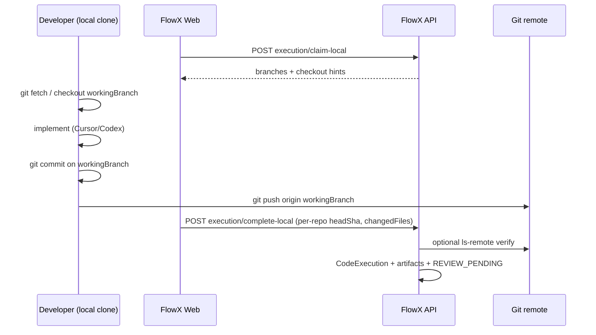

# Local Execution Handoff — Design Spec

> **Status:** Draft v2 (developer workspace flow)  
> **Depends on:** [Workflow HTML artifacts](../plans/2026-06-03-workflow-html-artifacts.md)  
> **Supersedes:** Sandbox-only strategy in v1 draft  
> **Human gate:** Approve before implementing `docs/superpowers/plans/2026-06-03-local-execution-handoff.md`

## Problem

`POST /workflow-runs/:id/execution/run` runs AI in **server sandboxes**. Real development happens in the developer’s **local clone** (Cursor / Codex / terminal). There is no串联 flow for:

1. Knowing **which workflow branch** to use per repository  
2. Checking out that branch locally, committing, pushing  
3. **Updating the workflow** (execution complete → review) with what was done locally  

Cloud execution stays for unattended runs. Local handoff is an alternate **executor** on the same state machine.

## Goals

| Goal | Measure |
|------|---------|
| Branch clarity | After claim, user sees `workingBranch`, `baseBranch`, repo name, suggested git commands |
| Local git | User works in their machine; FlowX does **not** require `.flowx-data` sandbox edits |
| Commit + sync | User commits (and should push); `complete-local` records SHAs and advances workflow |
| State parity | Same post-execution path as cloud (`REVIEW_PENDING` / bug-fix → `HUMAN_REVIEW_PENDING`) |
| Artifacts | `execution/report.html` + `execution.meta.json` from reported + optional remote verify |

## Non-goals (this slice)

- VS Code extension UI (API + Web copy/commands first; extension uses same APIs)  
- Full MCP package (wrap HTTP in follow-up)  
- Auto-running git on the user’s laptop from the server  
- Replacing `publishGitChanges` (still used after `DONE` for publish branches)  

## End-to-end flow (串联)



### Step-by-step (human)

| Step | Who | Action |
|------|-----|--------|
| 1 | FlowX | Plan confirmed → `EXECUTION_PENDING` |
| 2 | User | **本地执行** → `claim-local` → `EXECUTION_RUNNING`, `executor=LOCAL` |
| 3 | FlowX | Show per repo: `workingBranch` (e.g. `flowx/work/{slug}/{runId8}`), `baseBranch`, remote URL |
| 4 | Developer | In **local clone** of that repo: `git fetch`, checkout/create `workingBranch` from `baseBranch` |
| 5 | Developer | Implement; run tests locally |
| 6 | Developer | `git commit` on `workingBranch` (message template from FlowX optional) |
| 7 | Developer | `git push` to `origin` (required for team visibility + server verify) |
| 8 | User | **完成本地执行** → `complete-local` with commit metadata → workflow updated |
| 9 | FlowX | **AI 审查** / 人工确认（现有流程） |

**Important:** Server sandboxes under `.flowx-data` are **not** the edit target for local handoff. They may still exist for cloud execution and grounding; local flow only **references branch names** tied to the workflow record.

## Branch naming (existing)

From `WorkflowService.buildWorkflowBranchName`:

```text
flowx/work/{requirementSlug≤24}/{workflowRunIdLast8}
```

Stored on `WorkflowRepository.workingBranch` at workflow creation. `baseBranch` is the branch the workflow was prepared from.

## API surface

| Method | Path | Purpose |
|--------|------|---------|
| `POST` | `/workflow-runs/:id/execution/claim-local` | Claim LOCAL; response includes **handoff** payload |
| `POST` | `/workflow-runs/:id/execution/complete-local` | Body: per-repo commit report; finalize workflow |
| `POST` | `/workflow-runs/:id/execution/cancel-local` | Cancel LOCAL claim |
| `GET` | `/workflow-runs/:id/execution/local-handoff` | Same handoff JSON (refresh without re-claim) |
| `GET` | `/workflow-runs/:id/artifacts/execution` | HTML report after complete |

Cloud: existing `POST .../execution/run` unchanged.

### `claim-local` response (handoff card)

```json
{
  "workflowRunId": "cmxxx",
  "status": "EXECUTION_RUNNING",
  "executor": "LOCAL",
  "requirement": {
    "id": "...",
    "title": "...",
    "acceptanceCriteria": "..."
  },
  "plan": { "summary": "...", "implementationPlan": [], "filesToModify": [], "newFiles": [], "riskPoints": [] },
  "tasks": [],
  "repositories": [
    {
      "workflowRepositoryId": "...",
      "repositoryId": "...",
      "name": "ai-platform",
      "url": "https://github.com/org/repo.git",
      "baseBranch": "main",
      "workingBranch": "flowx/work/login-modal/cmxxx1234",
      "checkout": {
        "fetch": "git fetch origin",
        "checkout": "git checkout -B flowx/work/login-modal/cmxxx1234 origin/main",
        "push": "git push -u origin flowx/work/login-modal/cmxxx1234"
      },
      "suggestedCommitMessage": "flowx(wf cmxxx): ..."
    }
  ],
  "artifacts": {
    "planMetaPath": "plan/v1/plan.meta.json",
    "planHtmlUrl": "/workflow-runs/cmxxx/artifacts/plan"
  }
}
```

`checkout` strings are **hints** (not executed server-side). UI shows copy buttons.

### `complete-local` request body

```json
{
  "repositories": [
    {
      "workflowRepositoryId": "wr_1",
      "headSha": "abc123full40char",
      "changedFiles": ["apps/web/src/Foo.tsx"],
      "patchSummary": "Add welcome modal"
    }
  ],
  "pushed": true
}
```

| Field | Required | Notes |
|-------|----------|-------|
| `repositories` | Yes | At least one entry per repo user touched; may omit untouched repos |
| `headSha` | Yes per entry | Tip of `workingBranch` after local commit |
| `changedFiles` | Yes per entry | Paths relative to repo root |
| `patchSummary` | No | User/Agent summary; merged into report |
| `pushed` | Recommended | If true, server verifies branch on remote |

### `complete-local` server behavior

1. Validate `EXECUTION_RUNNING` + `input.executor === LOCAL`  
2. Validate each `workflowRepositoryId` belongs to run  
3. If `pushed === true` and repo has `url`: `git ls-remote` verify `refs/heads/{workingBranch}` contains `headSha` (or is ancestor — v1: exact match on tip)  
4. Build `ExecuteTaskOutput`-shaped result from body (no sandbox `git diff`)  
5. `finalizeExecutionSuccess` (shared with cloud)  
6. `writeExecutionArtifact` with `executor: LOCAL`, store per-repo `headSha` in meta  
7. Transition to review stage  

If `pushed === false`: allow complete with warning in `statusMessage` (team may not see code on remote). v1 can **require** `pushed: true` if product prefers — **default: require push** for complete.

Reject if `changedFiles` empty and no `headSha` movement vs recorded base (optional v1: only check non-empty changedFiles).

### `cancel-local`

Same as prior draft: back to `EXECUTION_PENDING`, stage failed/rejected.

## Data model (no Prisma migration v1)

- `StageExecution.input.executor`: `LOCAL` | `CLOUD`  
- `StageExecution.input.claimedAt`, `claimedByUserId`  
- `StageExecution.input.handoffSnapshot`: optional copy of branches at claim time  
- `execution.meta.json`: per-repo `headSha`, `workingBranch`, `pushed`, `verified`  
- `CodeExecution`: existing fields populated from client report (not sandbox diff)

## Web UI (MVP)

### After claim / on EXECUTION_RUNNING + LOCAL

**Handoff panel** (not sandbox paths):

- Table: 仓库名 | 工作分支 | 基线分支 | 操作（复制 checkout 命令）  
- Link to plan HTML preview (existing)  
- Short checklist: 切分支 → 开发 → 提交 → 推送 → 点击下方完成  

### Actions

| State | Buttons |
|-------|---------|
| `EXECUTION_PENDING` | 云端执行 · 本地执行 |
| `EXECUTION_RUNNING` + LOCAL | 完成本地执行 · 取消本地执行 |

### Complete dialog (v1 simple)

Form per repository in workflow:

- `headSha` (text, required)  
- `changedFiles` (textarea, one path per line)  
- `patchSummary` (optional)  
- Checkbox: 已推送到远程 (`pushed`)  

Future: extension/MCP pre-fills from `git rev-parse HEAD` and `git diff --name-only`.

## Agent / MCP (follow-up, same contract)

- `flowx_get_local_handoff(runId)` → handoff JSON  
- `flowx_complete_local(runId, body)` → complete-local  
- Prompt template: “Checkout `workingBranch`, implement plan, commit, push, then call complete with headSha.”

## Security

- Session auth on all routes  
- `workflowRepositoryId` must belong to `workflowRunId`  
- Remote verify only against registered `url` (no arbitrary URLs from client)  
- Do not accept `localPath` from client that points server filesystem  

## Refactor

Extract `finalizeExecutionSuccess` from `runExecution` so cloud and local share transitions + `CodeExecution` upsert.

## Risks

| Risk | Mitigation |
|------|------------|
| User commits on wrong branch | Prominent `workingBranch` in UI; checkout commands in handoff |
| Fake headSha | Require `pushed` + ls-remote verify when url present |
| Branch not on remote yet | Complete disabled until verify passes; show error “请先 push” |
| Multi-repo partial work | complete accepts subset; document that review uses reported repos |

## Approaches (revised)

| Approach | Verdict |
|----------|---------|
| A. Client reports SHA + files after local commit (**chosen**) | Matches user workflow |
| B. Server sandbox git diff | **Rejected** for local |
| C. Server only ls-remote, no client body | Insufficient for changedFiles summary |
| D. Hybrid: client body + optional ls-remote verify | **MVP** |

## Approval checklist

- [ ] Local work is on **developer clone**, not FlowX sandbox  
- [ ] `complete-local` requires push + remote verify when `url` exists  
- [ ] Handoff shows `flowx/work/...` branch and copy-paste git commands  
- [ ] Ready for updated implementation plan  
