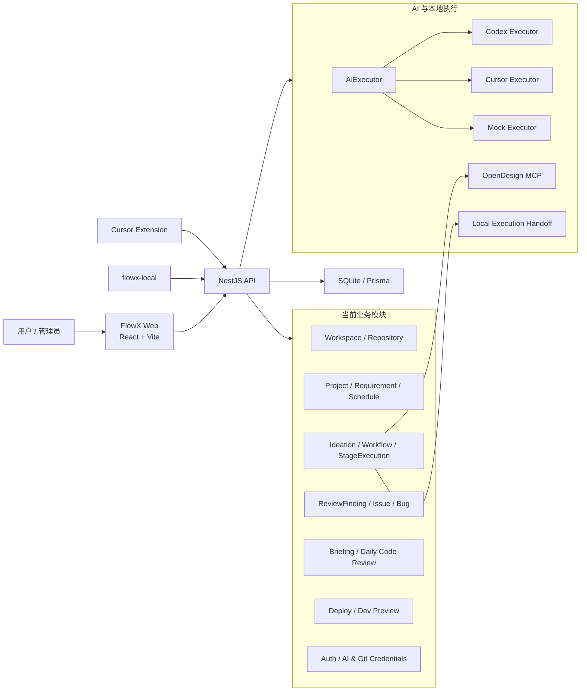

# FlowX 系统设计：现状与目标演进

> 本文描述当前代码已经具备的系统边界，并链接到后续建设采用的目标架构。规划能力不能当作已上线能力对外承诺。

## 1. 系统定位

FlowX 当前是一个支持中断、恢复和人工确认的 AI 研发流程编排系统，已经覆盖工作区、项目、需求、AI ideation、研发工作流、本地执行交接、审查沉淀、排期、项目简报、每日 Code Review 和部署集成。

后续目标是演进为端云协同 AI 产研平台：用户继续使用 Cursor、Codex、OpenDesign、IDE、CLI 和测试工具完成专业工作，FlowX 作为组织级控制平面统一项目、上下文、流程、状态、证据、质量、交付与治理。

完整目标架构见：

- [FlowX 端云协同 AI 产研平台目标架构](architecture/edge-cloud-ai-rd-platform.md)
- [目标架构展示图](architecture/assets/flowx-edge-cloud-ai-rd-platform.png)

## 2. 当前实现架构



## 3. 当前模块边界

### 3.1 后端

| 模块 | 当前职责 | 目标中心 |
| --- | --- | --- |
| `workspaces` | 工作区、Repository 登记、同步和本地副本 | 项目管理中心 / AI 上下文中心 |
| `projects` | 项目基础信息 | 项目管理中心 |
| `requirements` | 需求、ideation、设计和 demo 编排 | 项目管理中心 / 研发流程中心 |
| `workflow` | 工作流状态机、阶段执行、本地/云端执行和审查 | 研发流程中心 |
| `ai`、`prompts` | Executor、Prompt 和输出 schema | AI 上下文中心 |
| `schedule` | 需求排期与成员分配 | 项目管理中心 |
| `briefings` | 项目事件、简报、投递目标 | 项目管理中心 / 治理与度量中心 |
| `daily-code-review` | 独立 Code Review 调度和报告 | 测试与质量中心 |
| `review-artifacts` | Finding、Issue、Bug 转换和维护 | 测试与质量中心 |
| `deploy` | Repository 级部署 Provider | 发布与运维中心 |
| `dev-preview` | 本地预览命令和生命周期 | 发布与运维中心 |
| `auth` | 用户、组织、会话和凭据 | 治理与度量中心 |
| `cursor-local` | Cursor 本地任务和 Chat 交接 | 迁移到通用 Edge/Sync 边界 |

### 3.2 前端

FlowX Web 当前提供：

- 工作区和 Repository 管理。
- 项目、需求、工作流和排期。
- Ideation、设计 Artifact、执行、Review 和人工确认。
- Issue、Bug、项目简报和每日 Code Review。
- AI/Git 凭据、组织用户、数据源和投递目标设置。

后续页面应围绕六个中心组织，但在功能具备前不进行只改导航名称的空壳重构。

### 3.3 本地接入

当前本地接入由两部分组成：

- `apps/cursor-extension`：任务列表、仓库匹配、Chat 交接和完成报告。
- `packages/flowx-local`：本地启动、Repository 映射、IDE 打开和 Skill 安装。

演进方向是保留现有兼容接口，将 `flowx-local` 扩展为 FlowX Edge Agent，并把 Cursor 专用逻辑下沉为 `CursorAdapter`。

## 4. 当前核心数据链路

```text
Workspace
  -> Project
  -> Requirement
  -> RequirementRepository
  -> WorkflowRun
  -> WorkflowRepository
  -> StageExecution
  -> Task / Plan / CodeExecution / ReviewReport
  -> ReviewFinding
  -> Issue / Bug
  -> DeployJobRecord
```

该链路已经具备研发流程基础，但 Artifact、Evidence、TestRun、ExecutionSession、Release 和 RuntimeFeedback 仍需成为独立领域对象，不能长期依赖 `StageExecution.input/output` 或零散 JSON 承载。

## 5. 工作流设计原则

- `WorkflowRun` 表达一次业务流程。
- `StageExecution` 按 attempt 追加，保留阶段执行历史。
- 状态流转统一通过 `WorkflowStateMachine` 或工作流编排服务校验。
- 本地执行和云端执行是同一状态机上的不同 executor。
- 人工确认是流程能力，不应耦合具体 AI Provider。
- 后续新增 `ExecutionSession` 表达一次真实的本地、Agent、Worker 或测试执行。

## 6. AI 与工具接入原则

- 业务服务依赖 `AIExecutor` 或后续通用执行契约，不直接依赖 Provider SDK。
- Prompt、输出 schema 和校验逻辑保持单一事实来源。
- Cursor、Codex、OpenDesign 等端侧工具通过 Adapter 接入统一同步协议。
- MCP 用于提供上下文和工具调用，不拥有 FlowX 的业务状态。
- 源代码以 Git 为事实来源；FlowX 保存分支、Commit、MR、摘要和 Evidence。

## 7. 目标模块

```text
FlowX 云端控制平面
├── 项目管理中心
├── 研发流程中心
├── AI 上下文中心
├── 测试与质量中心
├── 发布与运维中心
└── 治理与度量中心

FlowX 端侧执行平面
├── FlowX Edge Agent
├── Tool Adapter SPI
├── Repository / Branch Mapping
├── Local Runner
├── Artifact / Evidence Collector
└── Offline Queue

端云同步层
├── Command
├── Context Package
├── Sync Event
├── Artifact Upload
└── Identity / Idempotency / Trace
```

详细领域职责、同步事件、数据所有权和 90 天路线以目标架构文档为准。

## 8. 基础设施演进

| 阶段 | 数据库 | 异步任务 | Artifact | 部署形态 |
| --- | --- | --- | --- | --- |
| 当前 MVP | SQLite | 进程内调度 | 本地文件和数据库记录 | 单实例 API + Web |
| 端云协同第一阶段 | SQLite/PostgreSQL 过渡 | Redis/BullMQ | MinIO/S3 | API + Worker |
| 企业部署 | PostgreSQL | 可靠队列和独立 Worker | Object Storage | 多实例 API + Worker Pool |

近期保持模块化单体，不按业务中心直接拆微服务。拆分触发条件包括独立扩缩容、独立故障域、独立安全边界或明确的团队所有权。

## 9. 实施优先级

1. 抽取通用 Edge Agent、ExecutionSession 和同步协议。
2. 建立 Artifact/Evidence Center 和数字主线关联。
3. 接入 Cursor、Codex、OpenDesign Adapter。
4. 建设 Test Plan、Test Case、Test Run 和质量门禁。
5. 串联 Release、Environment、Deployment 和运行反馈。
6. 再推进 PostgreSQL、多实例、企业权限、审计和成本治理。

## 10. 文档维护规则

- 本文维护当前实现边界和目标演进索引。
- `docs/architecture/edge-cloud-ai-rd-platform.md` 维护目标架构和实施原则。
- 具体功能设计继续放在对应专题文档中。
- 架构发生变化时，先更新 Mermaid 权威图，再更新 PNG 展示图。
- 规划能力上线后，必须同步更新 README、用户手册和相关 API/数据模型文档。
